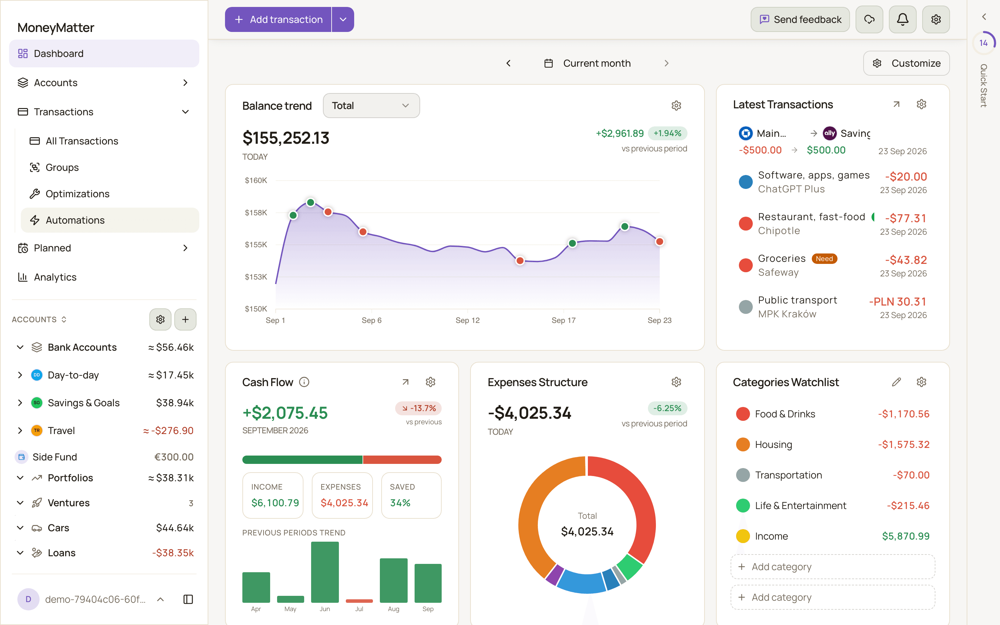
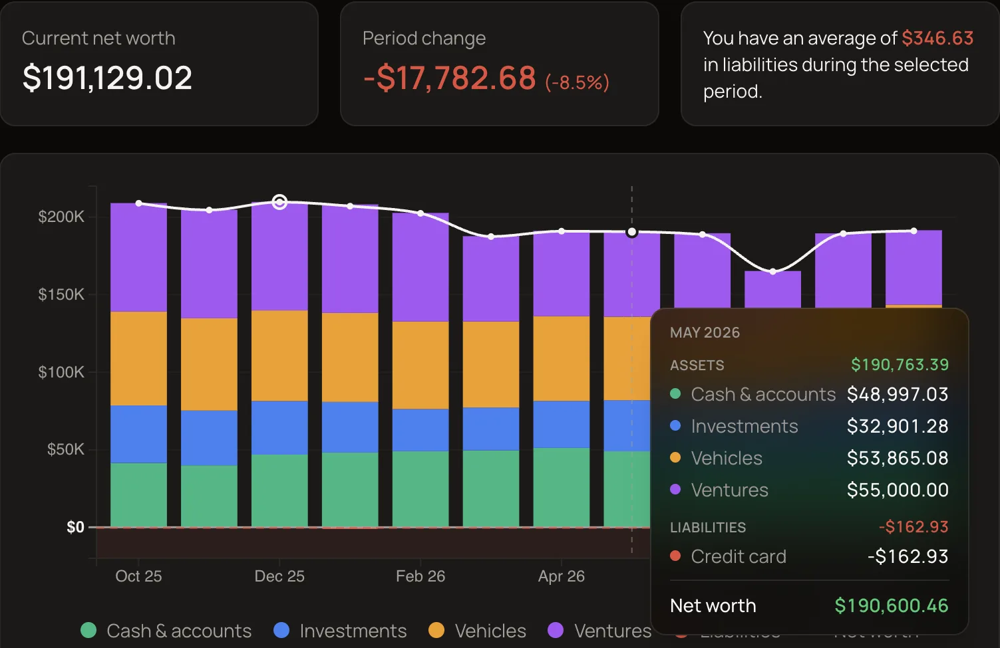
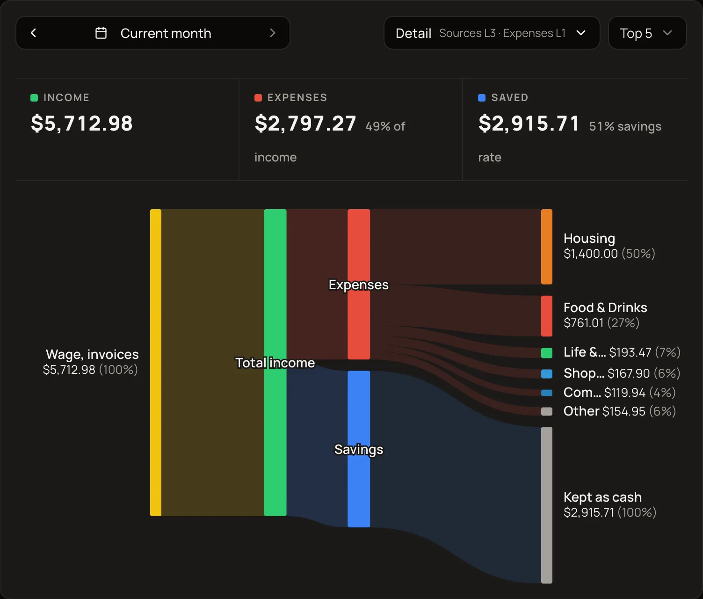
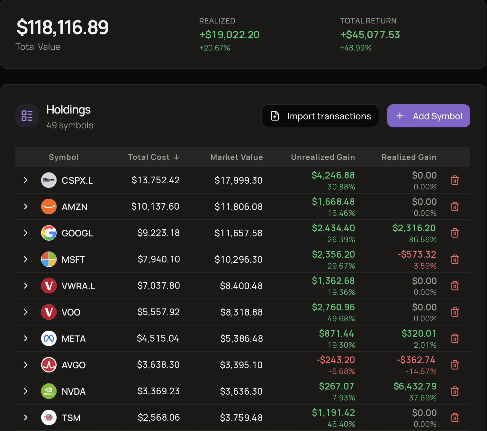
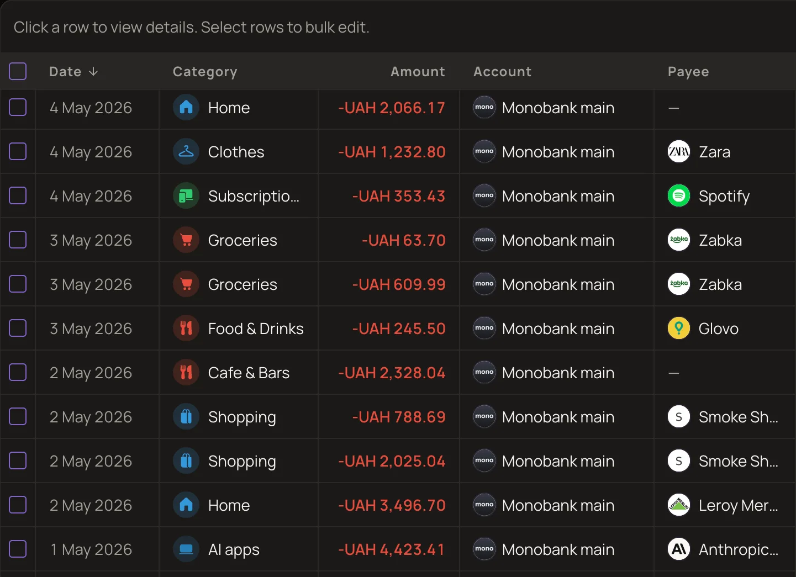
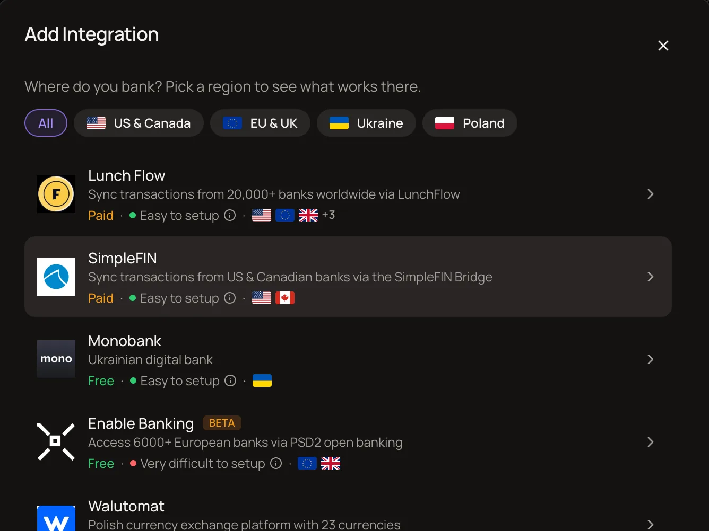
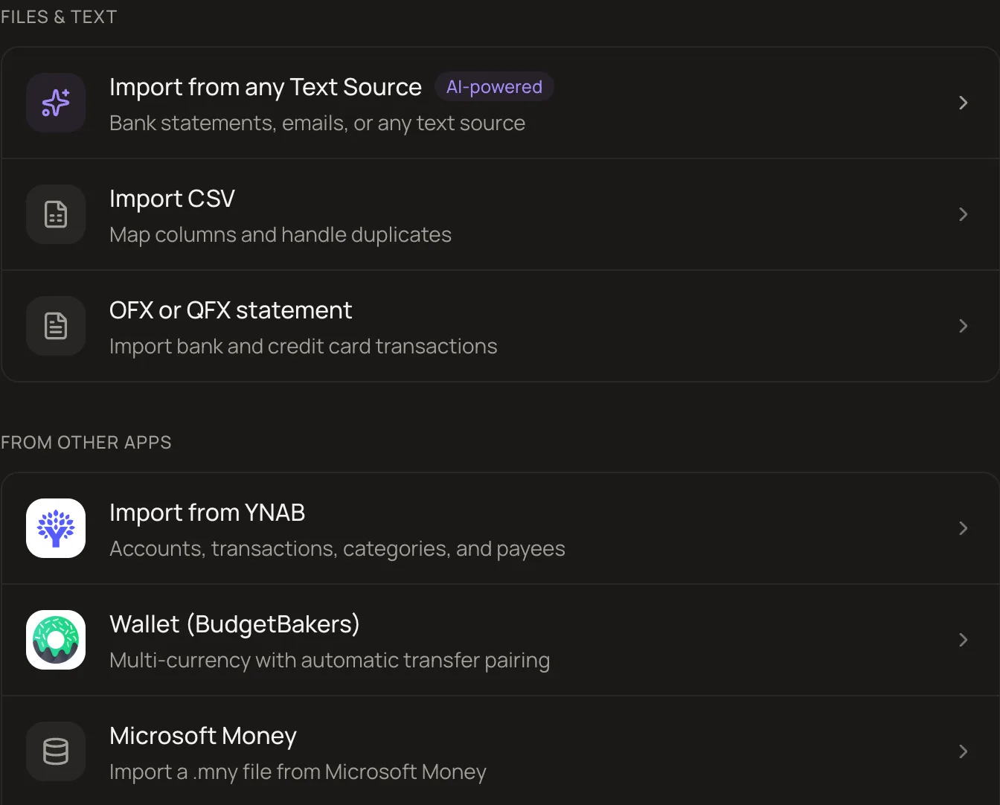

<div align="center">


# MoneyMatter

**Open-source personal finance. Your finances, your server, your rules.**

Accounts, budgets, investments, loans and net worth in one place.<br>
Self-host it for free, or use the cloud.

[Website](https://moneymatter.app) · [Docs](https://docs.moneymatter.app) · [Self-host](self-hosting/README.md) · [Cloud](https://moneymatter.app/sign-up) · [Roadmap](https://moneymatter.featurebase.app/dashboard/roadmap) · [Changelog](https://github.com/letehaha/moneymatter/releases)

[](https://www.gnu.org/licenses/agpl-3.0)
[](https://github.com/letehaha/moneymatter/actions/workflows/check-source-code.yml)
[](https://github.com/letehaha/moneymatter/releases)
[](https://crowdin.com/project/moneymatter)

</div>

<picture>
  <source media="(prefers-color-scheme: dark)" srcset="packages/docs/public/screenshots/getting-started/app-overview.dark.png">
  
</picture>

<details>
<summary><b>More screenshots</b></summary>
<br>

<table>
  <tr>
    <td width="50%">
      
      <br><sub>Net worth history</sub>
    </td>
    <td width="50%">
      
      <br><sub>Money flow</sub>
    </td>
  </tr>
  <tr>
    <td width="50%">
      
      <br><sub>Investments</sub>
    </td>
    <td width="50%">
      
      <br><sub>Transactions</sub>
    </td>
  </tr>
  <tr>
    <td width="50%">
      
      <br><sub>Bank connections</sub>
    </td>
    <td width="50%">
      
      <br><sub>Import sources</sub>
    </td>
  </tr>
</table>

Every feature is explained, with screenshots, in the [help center](https://docs.moneymatter.app).

</details>

MoneyMatter shows you where your money is and where it goes. Add accounts by hand or sync them from your bank, and it turns your transactions into balances, a dashboard and reports in one base currency. It goes beyond cash: investments, loans, vehicles and private deals are part of your net worth too. Any AI agent can work with your data over MCP.

> [!TIP]
> [MoneyMatter Cloud](https://moneymatter.app) is the same app, hosted: a 40-day free trial, no card required. Self-hosting is free and every feature is enabled.

## Contents

1. [Features](#features)
2. [Get started](#get-started)
3. [Connect an AI agent](#connect-an-ai-agent)
4. [Documentation](#documentation)
5. [Tech stack](#tech-stack)
6. [Contributing](#contributing)
7. [License](#license)

## Features

- **Accounts** in any currency, manual or [synced from your bank](https://docs.moneymatter.app/import/bank-connections/) through Monobank, SimpleFIN, LunchFlow, Enable Banking and Walutomat
- **Transactions** with categories, payees, tags, splits, attachments, [transfers and refunds](https://docs.moneymatter.app/transfers-and-refunds/how-transfers-work/), and automation rules for new ones
- **Budgets**, subscriptions and bills with reminders, and loans with a payoff projection
- **Investments**: portfolios of stocks, ETFs and crypto with daily prices, plus venture deals and [vehicles](https://docs.moneymatter.app/accounts/vehicles/), all counted in your net worth
- **Reports**: a customizable [dashboard](https://docs.moneymatter.app/stats/dashboard/), cash flow, money flow, net worth history and a [pivot table](https://docs.moneymatter.app/stats/analytics-reports/)
- **Multi-currency** with [automatic exchange rates](https://docs.moneymatter.app/settings/base-currency-and-currencies/) and one base currency for every total
- **Import** from [CSV](https://docs.moneymatter.app/import/import-from-csv/), OFX/QFX, [YNAB, Wallet and Microsoft Money](https://docs.moneymatter.app/import/other-import-sources/), or any statement file parsed with AI. Export to JSON, CSV or XLSX, and [back up and restore](https://docs.moneymatter.app/settings/security-and-account/#backup-and-restore) everything
- **AI**: bring your own model (OpenAI, Anthropic, Google, Ollama or any OpenAI-compatible endpoint) for categorization and statement parsing, and a remote MCP server for Claude, ChatGPT or any agent
- **Sharing**: share an account or budget with someone, or give a household member access to all your accounts
- **Security**: sign in with [email, Google, GitHub or passkeys](https://docs.moneymatter.app/settings/security-and-account/), credentials encrypted at rest, and your data exportable or deletable at any time
- **Everywhere**: light and dark theme, a layout that works on your phone, and English, Ukrainian, Spanish, Indonesian and Russian

## Get started

**Try it.** The **Try demo** button on [moneymatter.app](https://moneymatter.app) opens a ready-made account with sample data. No sign-up required, and it expires after four hours.

**Self-host.** The stack pulls published Docker images (amd64; ARM hosts can build from source) and exposes the whole app on one port, so you can put it behind whatever reverse proxy you already run, or use the optional Traefik + Let's Encrypt overlay.

```bash
git clone https://github.com/letehaha/moneymatter.git
cd moneymatter/self-hosting
cp .env.example .env   # then fill the REQUIRED section
docker compose up -d
```

Open `http://<host>:8080`. The [self-hosting guide](self-hosting/README.md) covers the full setup, reverse-proxy recipes, every environment variable and troubleshooting.

**Cloud.** [Sign up](https://moneymatter.app/sign-up) for a 40-day free trial with no card. Paid plans start at $30 a year. See [plans and billing](https://docs.moneymatter.app/settings/plans-and-billing/) for details. You can move between cloud and self-hosted in either direction with a backup export and restore.

## Connect an AI agent

MoneyMatter exposes a remote [MCP](https://modelcontextprotocol.io) server. Add the endpoint to Claude, ChatGPT or any MCP client, pick the access level on the consent screen, and ask questions the UI can't answer: "Which of my subscriptions got more expensive this year?" or "Where can I realistically cut $500 a month?"

```
https://mcp.moneymatter.app/mcp
```

A self-hosted instance serves its own endpoint. See `MCP_BASE_URL` in the [environment reference](self-hosting/docs/environment-reference.md). Connected apps are listed and revocable under **Settings → AI**.

## Documentation

- [Help center](https://docs.moneymatter.app): user guides for accounts, transactions, transfers and refunds, stats, imports, bank connections and settings
- [Self-hosting guide](self-hosting/README.md)
- [Local development setup](docs/application-setup.md)
- [Contributing](CONTRIBUTING.md)

## Tech stack

Vue 3, Vite, TypeScript and Tailwind CSS on the frontend. Node.js, Express, Sequelize, PostgreSQL and Redis with BullMQ on the backend. better-auth for sign-in, the Vercel AI SDK for model access, and the official MCP SDK for the agent server. The docs site runs on Astro Starlight. Everything ships as Docker images.

## Contributing

Bug reports, fixes and features are welcome. Open an issue first for anything non-trivial, then follow [CONTRIBUTING.md](CONTRIBUTING.md) for the workflow and the one-time CLA.

Translations live on [Crowdin](https://crowdin.com/project/moneymatter). Corrections and new languages are welcome there.

## License

This project is licensed under the **GNU Affero General Public License v3.0 (AGPL-3.0)**.

- ✅ Free to use, study, modify, and self-host
- ✅ Free to redistribute under the same license
- ✅ Commercial use permitted (sell hosting, support, custom builds, etc.)
- 🔄 Modifications must be released under AGPL-3.0
- 🌐 If you run a modified version as a network service, you must publish your modifications

See [LICENSE](LICENSE) for full details. The project was previously licensed under CC BY-NC-SA 4.0; that license still applies to versions of the codebase prior to the AGPL-3.0 relicensing commit.
