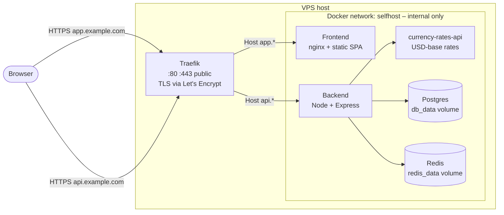
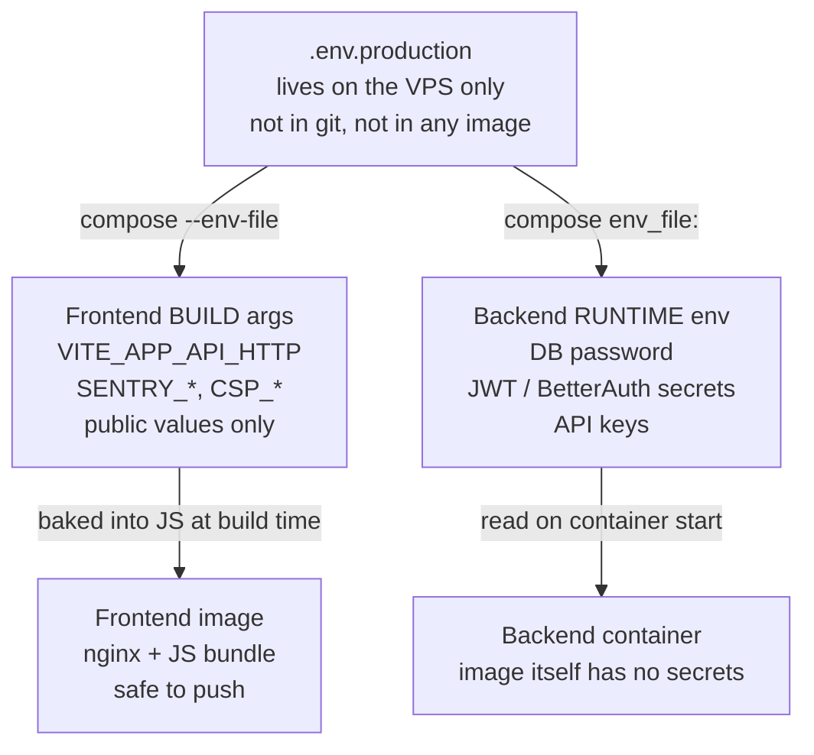

# Self-Hosting Guide

Run Budget Tracker on your own VPS. This guide assumes:

- A fresh Ubuntu 22.04 / 24.04 (or Debian 12) VPS
- Two DNS A records you control – one for the app, one for the API
- Ports 80 and 443 reachable from the public internet (Let's Encrypt requirement)
- 2 GB RAM minimum, 4 GB recommended (the build is the heaviest step)

The bundled stack uses **Traefik** for HTTPS termination and routing, **Postgres**
for storage, **Redis** for queues, and the `currency-rates-api` sidecar for
exchange-rate data. No external API keys are required for core functionality.

### What lives where



Only Traefik binds public ports. Postgres and Redis bind to `127.0.0.1`
on the host (admin via SSH tunnel only) and are otherwise reachable just
from the `selfhost` Docker network. The rate-data sidecar never leaves
that network.

> **Architecture**: works on both `amd64` and `arm64` VPSes (Hetzner ARM,
> Oracle Ampere, AWS Graviton). The rate-data sidecar is currently only
> published as `amd64`, so on `arm64` hosts Docker runs it under QEMU
> emulation – functional but slower at sync time. All other services
> (frontend, backend, postgres, redis, traefik) are multi-arch native.

## Table of Contents

1. [DNS](#1-dns)
2. [Install Docker on the VPS](#2-install-docker-on-the-vps)
3. [Clone the repository](#3-clone-the-repository)
4. [Configure `.env.production`](#4-configure-envproduction)
5. [Build and start](#5-build-and-start)
6. [Run database migrations](#6-run-database-migrations)
7. [Verify](#7-verify)
8. [Updating](#8-updating)
9. [Backups](#9-backups)
10. [Localhost / no-DNS testing](#10-localhost--no-dns-testing)
11. [Environment variable reference](#environment-variable-reference)
12. [Troubleshooting](#troubleshooting)

---

## 1. DNS

You have two paths here. Pick one.

### A. You own a domain

Create two **A records** pointing at your VPS public IP:

| Host              | Type | Value           |
| ----------------- | ---- | --------------- |
| `app.example.com` | A    | `<your VPS IP>` |
| `api.example.com` | A    | `<your VPS IP>` |

Replace `example.com` with your domain. Both records must resolve before
Let's Encrypt can issue certificates.

Verify:

```bash
dig +short app.example.com
dig +short api.example.com
```

Both should print your VPS IP.

### B. No domain – use nip.io

[**nip.io**](https://nip.io) turns any IP into a real DNS name with no
signup, no DNS records, no cost. If your VPS public IP is `203.0.113.42`,
the hostnames below already resolve to it:

```
app.203-0-113-42.nip.io   → 203.0.113.42
api.203-0-113-42.nip.io   → 203.0.113.42
```

Use them as your `SELFHOST_FRONTEND_DOMAIN` / `SELFHOST_API_DOMAIN` in
step 4. Let's Encrypt issues real certificates for nip.io subdomains, so
Traefik works the same way and you get genuine HTTPS – no browser
warnings. (nip.io is on the Public Suffix List, so its rate limits
don't pool across other users.)

Dotted form (`app.203.0.113.42.nip.io`) also works; the dashed form is
just easier to read in `.env.production`. Verify:

```bash
dig +short app.203-0-113-42.nip.io
# 203.0.113.42
```

Same caveats as path A: ports 80 and 443 must be reachable from the
public internet, and nothing else can be holding them on the VPS.

## 2. Install Docker on the VPS

Most cloud Ubuntu images ship with `curl`, `git`, and `openssl` already.
On lean images (some container hosts, custom AMIs) install them first:

```bash
sudo apt-get update
sudo apt-get install -y curl git openssl ca-certificates
```

Then add Docker's repo and install the engine + compose plugin:

```bash
# Add Docker's official repo
sudo install -m 0755 -d /etc/apt/keyrings
curl -fsSL https://download.docker.com/linux/ubuntu/gpg | sudo tee /etc/apt/keyrings/docker.asc > /dev/null
sudo chmod a+r /etc/apt/keyrings/docker.asc
echo "deb [arch=$(dpkg --print-architecture) signed-by=/etc/apt/keyrings/docker.asc] https://download.docker.com/linux/ubuntu $(. /etc/os-release && echo $VERSION_CODENAME) stable" | sudo tee /etc/apt/sources.list.d/docker.list > /dev/null
sudo apt-get update
sudo apt-get install -y docker-ce docker-ce-cli containerd.io docker-buildx-plugin docker-compose-plugin

# Allow your user to run docker without sudo (log out + back in after)
sudo usermod -aG docker "$USER"
```

Verify:

```bash
docker --version
docker compose version
```

## 3. Clone the repository

```bash
git clone https://github.com/letehaha/budget-tracker.git
cd budget-tracker
```

## 4. Configure `.env.production`

```bash
cp .env.production.example .env.production
```

Open `.env.production` and fill the **REQUIRED** section. The minimum to
boot:

```bash
# Domains
SELFHOST_FRONTEND_DOMAIN=app.example.com
SELFHOST_API_DOMAIN=api.example.com
LETSENCRYPT_EMAIL=you@example.com

# Backend public URL + frontend origin
BETTER_AUTH_URL=https://api.example.com
AUTH_ORIGIN=https://app.example.com

# Auth secrets (generate fresh, distinct values)
APPLICATION_JWT_SECRET=<paste output of: openssl rand -base64 32>
APP_SESSION_ID_SECRET=<paste output of: openssl rand -base64 32>
BETTER_AUTH_SECRET=<paste output of: openssl rand -base64 32>

# Database
APPLICATION_DB_USERNAME=budget_tracker
APPLICATION_DB_PASSWORD=<paste output of: openssl rand -base64 32>
APPLICATION_DB_DATABASE=budget_tracker

# Frontend (inlined at Docker build)
VITE_APP_API_HTTP=https://api.example.com
```

Generate four distinct secrets at once:

```bash
for v in APPLICATION_JWT_SECRET APP_SESSION_ID_SECRET BETTER_AUTH_SECRET APPLICATION_DB_PASSWORD; do
  printf '%s=%s\n' "$v" "$(openssl rand -base64 32)"
done
```

> **Frontend env vars (`VITE_*`) are inlined into the JS bundle at Docker
> BUILD time.** Editing them later requires `docker compose build` again.
> Backend env vars are read at container start – restart, not rebuild.

> **Keep `.env.production` on the VPS, not in the image.** The compose file
> reads it via `--env-file` (compose-level interpolation) and `env_file:`
> (runtime container env). It is never copied into the frontend or backend
> image, so DB password and auth secrets do not end up in pushed image
> layers. Do **not** check `.env.production` into git.

> The backend boots with a placeholder check – if any of
> `APPLICATION_JWT_SECRET`, `APP_SESSION_ID_SECRET`, `BETTER_AUTH_SECRET`,
> or `APPLICATION_DB_PASSWORD` is still set to `__REPLACE_ME__`, the
> container exits before serving any request.

How `.env.production` reaches each service:



The frontend image is fully public-safe – it only contains values that
the browser sees anyway. Backend secrets are mounted at container start
and never written to any image layer.

Optional features (email, OAuth login, market data, AI categorisation,
observability) are commented out at the bottom of the file. Set only what
you need; the app boots without any of them.

## 5. Build and start

```bash
docker compose -f docker/prod/docker-compose.yml --env-file .env.production up -d --build
```

The first build takes 5–15 minutes depending on VPS specs (most of it is
`npm ci` + frontend build). Subsequent builds reuse cache.

Watch the logs:

```bash
docker compose -f docker/prod/docker-compose.yml logs -f
```

Traefik will request Let's Encrypt certificates on first request to either
domain. The first HTTPS request can take 10–30 seconds while ACME runs.

## 6. Database migrations (automatic)

The backend entrypoint runs `npm run migrate` before starting the server,
so migrations apply on every boot. After `git pull` + `up -d --build`,
they run automatically when the new container starts.

To force a re-run manually (idempotent – Sequelize skips applied
migrations):

```bash
docker compose -f docker/prod/docker-compose.yml exec backend npm run migrate
```

## 7. Verify

```bash
# Frontend serves the SPA
curl -fsSI https://app.example.com | head -1
# HTTP/2 200

# Backend liveness – get-session returns 200 with a literal `null` body
# for a fresh request (no cookie, no session). There is no /api/v1/health
# endpoint.
curl -fsS https://api.example.com/api/v1/auth/get-session
# null

# CSP includes your API origin (look for connect-src + your api domain)
curl -fsSI https://app.example.com | grep -i content-security-policy
```

Open `https://app.example.com` in a browser. You should see the landing
page; clicking through to **Sign Up** should let you register a user.

If you set `RESEND_API_KEY`, that user will get a verification email. If
not, they're activated immediately.

## 8. Updating

```bash
cd budget-tracker
git pull
docker compose -f docker/prod/docker-compose.yml --env-file .env.production up -d --build
```

Migrations run automatically when the new backend container starts. Watch
the logs to confirm:

```bash
docker compose -f docker/prod/docker-compose.yml logs -f backend
```

## 9. Backups

The two stateful volumes are `db_data` (Postgres) and `redis_data` (Redis).
Redis is queue-only – data is regenerated on the fly, so back up Postgres
only.

```bash
# Daily dump
docker compose -f docker/prod/docker-compose.yml exec -T db \
  pg_dump -U "$APPLICATION_DB_USERNAME" "$APPLICATION_DB_DATABASE" \
  | gzip > "backup-$(date +%F).sql.gz"
```

Restore:

```bash
gunzip -c backup-2026-05-01.sql.gz | \
  docker compose -f docker/prod/docker-compose.yml exec -T db \
  psql -U "$APPLICATION_DB_USERNAME" "$APPLICATION_DB_DATABASE"
```

## 10. Localhost / no-DNS testing

> **Docker Desktop note**: Traefik's Docker provider can't read container
> labels through Docker Desktop's daemon proxy, so HTTP routing returns
> 404 for both `app.localhost` and `api.localhost` even though the stack
> is healthy. Verify by hitting the backend directly inside the container
> instead – `docker compose exec backend wget -qO - http://localhost:8081/api/v1/auth/get-session`
> should print `null`. On a real Linux VPS this works as written.

> **Host port collisions**: this override still binds Traefik to host
> 80/443 by default. If those ports are taken, set `TRAEFIK_HTTP_PORT`
> and `TRAEFIK_HTTPS_PORT` (and `DB_HOST_PORT` / `REDIS_HOST_PORT` if
> Postgres/Redis are also already running on the host).

To validate the prod stack on a laptop without a domain or Let's Encrypt,
add the localhost override:

```bash
# In .env.production:
SELFHOST_FRONTEND_DOMAIN=app.localhost
SELFHOST_API_DOMAIN=api.localhost
VITE_APP_API_HTTP=http://api.localhost
AUTH_ORIGIN=http://app.localhost
BETTER_AUTH_URL=http://api.localhost

# Then:
docker compose \
  -f docker/prod/docker-compose.yml \
  -f docker/prod/docker-compose.localhost.yml \
  --env-file .env.production \
  up -d --build
```

Chrome / Firefox / Safari resolve `*.localhost` to `127.0.0.1`
automatically. For curl, add to `/etc/hosts`:

```
127.0.0.1 app.localhost api.localhost
```

This mode skips TLS – do not run it on a public VPS.

---

## Environment variable reference

### Required

| Variable                   | Purpose                                      |
| -------------------------- | -------------------------------------------- |
| `NODE_ENV`                 | Must be `production`                         |
| `SELFHOST_FRONTEND_DOMAIN` | Frontend host (Traefik routing)              |
| `SELFHOST_API_DOMAIN`      | API host (Traefik routing)                   |
| `LETSENCRYPT_EMAIL`        | Contact for ACME registrations               |
| `BETTER_AUTH_URL`          | Public backend URL (`https://<api domain>`)  |
| `AUTH_ORIGIN`              | Public frontend URL (`https://<app domain>`) |
| `APPLICATION_JWT_SECRET`   | Encryption key for stored credentials        |
| `APP_SESSION_ID_SECRET`    | Signs request-tracing cookies                |
| `BETTER_AUTH_SECRET`       | Signs all auth sessions / tokens             |
| `APPLICATION_DB_*`         | Postgres connection (host/port/user/pass/db) |
| `APPLICATION_REDIS_HOST`   | Redis hostname (defaults to `redis`)         |
| `APPLICATION_PORT`         | Backend listen port (defaults to `8081`)     |
| `VITE_APP_API_HTTP`        | API URL – inlined into the frontend bundle   |

### Optional (features off until set)

| Variable                                                  | Enables                            |
| --------------------------------------------------------- | ---------------------------------- |
| `RESEND_API_KEY`, `RESEND_FROM_EMAIL`                     | Email verification & notifications |
| `GOOGLE_CLIENT_ID` + `GOOGLE_CLIENT_SECRET`               | Google sign-in                     |
| `GITHUB_CLIENT_ID` + `GITHUB_CLIENT_SECRET`               | GitHub sign-in                     |
| `ENABLE_BANKING_REDIRECT_URL`                             | Open-banking integrations          |
| `POLYGON_API_KEY`, `ALPHA_VANTAGE_API_KEY`, `FMP_API_KEY` | Investments / market data          |
| `API_LAYER_API_KEYS`                                      | Premium currency-rate fallback     |
| `ANTHROPIC_API_KEY` / `OPENAI_API_KEY` / etc.             | AI transaction categorisation      |
| `VITE_LOGO_DEV_TOKEN`                                     | Brand logos (subs, banks, tickers) |
| `SENTRY_DSN`, `POSTHOG_KEY` (+ `VITE_*` twins)            | Error tracking / analytics         |
| `ADMIN_USERS`                                             | Comma-separated admin usernames    |
| `AUTH_RP_ID`, `AUTH_RP_NAME`                              | WebAuthn / passkey support         |

### Advanced

| Variable                                     | Purpose                                        |
| -------------------------------------------- | ---------------------------------------------- |
| `CSP_EXTRA_CONNECT`, `CSP_EXTRA_FORM_ACTION` | Override CSP defaults (auto-derived if unset)  |
| `CSP_EXTRA_ANALYTICS`                        | Extra CSP `connect-src` hosts (PostHog/Sentry) |
| `OFFLINE_MODE`                               | Disable background exchange-rate jobs          |
| `YAHOO_FINANCE_ENABLED`                      | Toggle Yahoo Finance investments source        |
| `DB_QUERY_LOGGING`                           | Log every SQL query                            |

---

## Troubleshooting

### Let's Encrypt: "unable to generate a certificate"

ACME TLS-ALPN-01 needs **port 443 reachable** from the internet. Verify:

```bash
sudo ss -tlnp | grep ':443'      # traefik should be listed
curl -fsS https://api.example.com/api/v1/auth/get-session  # from outside the VPS
```

If your VPS provider (Hetzner, DigitalOcean, etc.) has a separate firewall
panel, also check it allows 80/443 inbound.

### "CSP blocked: connect-src" in browser console

Means `VITE_APP_API_HTTP` was wrong at frontend build time, or
`CSP_EXTRA_CONNECT` was set to something incomplete. Fix the env, then:

```bash
docker compose -f docker/prod/docker-compose.yml build frontend
docker compose -f docker/prod/docker-compose.yml up -d
```

### "AUTH_ORIGIN must be set in production"

The backend hard-throws on this on boot. Set `AUTH_ORIGIN=https://<your
frontend domain>` in `.env.production` and restart `backend`.

### Migrations fail with "ENOENT: test-exchange-rates.json"

Older bug – your local checkout is below the fix. `git pull` and rebuild.

### Frontend builds, backend won't start: "ECONNREFUSED" to db

Wait – Postgres can take 10–30s on first boot to initialise data files. The
backend has a healthcheck-gated `depends_on` that should handle this, but
if you've customised compose, ensure the `db: { condition: service_healthy
}` clause is intact.

### "Too many open files" or build OOMs

Frontend build is memory-heavy. Add 2 GB swap:

```bash
sudo fallocate -l 2G /swapfile && sudo chmod 600 /swapfile
sudo mkswap /swapfile && sudo swapon /swapfile
echo '/swapfile none swap sw 0 0' | sudo tee -a /etc/fstab
```

### Traefik error: "API returned a 400 (Bad Request)" loop on startup

If you're testing on **Docker Desktop for Mac** (e.g. while iterating on the
self-host config locally) you may see Traefik fail to read the daemon
state. Stock Docker on a Linux VPS does not hit this. Two workarounds:

1. **Skip TLS for the local test** with the `docker-compose.localhost.yml`
   override – Traefik routing still fails on Docker Desktop, but
   `docker compose exec backend wget -qO - http://localhost:8081/api/v1/auth/get-session`
   confirms the rest of the stack.
2. **Front Traefik with `tecnativa/docker-socket-proxy`** as a sidecar; the
   proxy normalises the API surface and Docker Desktop accepts its calls.

This is purely a Docker Desktop quirk; on the production VPS path the
bundled compose works as-is.

### Resetting Let's Encrypt state (rate-limit recovery)

ACME has a 5 failures-per-hour cap. If you tripped it (typically by
deploying with bad DNS), wait an hour, then:

```bash
docker compose -f docker/prod/docker-compose.yml down
docker volume rm prod_traefik_letsencrypt
docker compose -f docker/prod/docker-compose.yml --env-file .env.production up -d
```

---

## Where to get help

- Issues: https://github.com/letehaha/budget-tracker/issues
- License: AGPL-3.0 – see `LICENSE`
