# Transaction Editing Flows

This document maps every state a transaction can be in and the rules that govern editing it. It is written for engineers extending the editing logic, and is structured so it can be repurposed as end-user help content later.

> **TL;DR**
> A transaction's editability is not a single flag. It is the product of four dimensions: **type** (expense/income), **nature** (regular / transfer / portfolio-link), **account type** (manual system account vs synced external account), and **access source** (you own it, it was shared with you, or it's visible only through a shared budget). Combining these dimensions yields the matrix below.

---

## 1. Mental Model

Every transaction has four orthogonal attributes that together determine what a user is allowed to do with it:

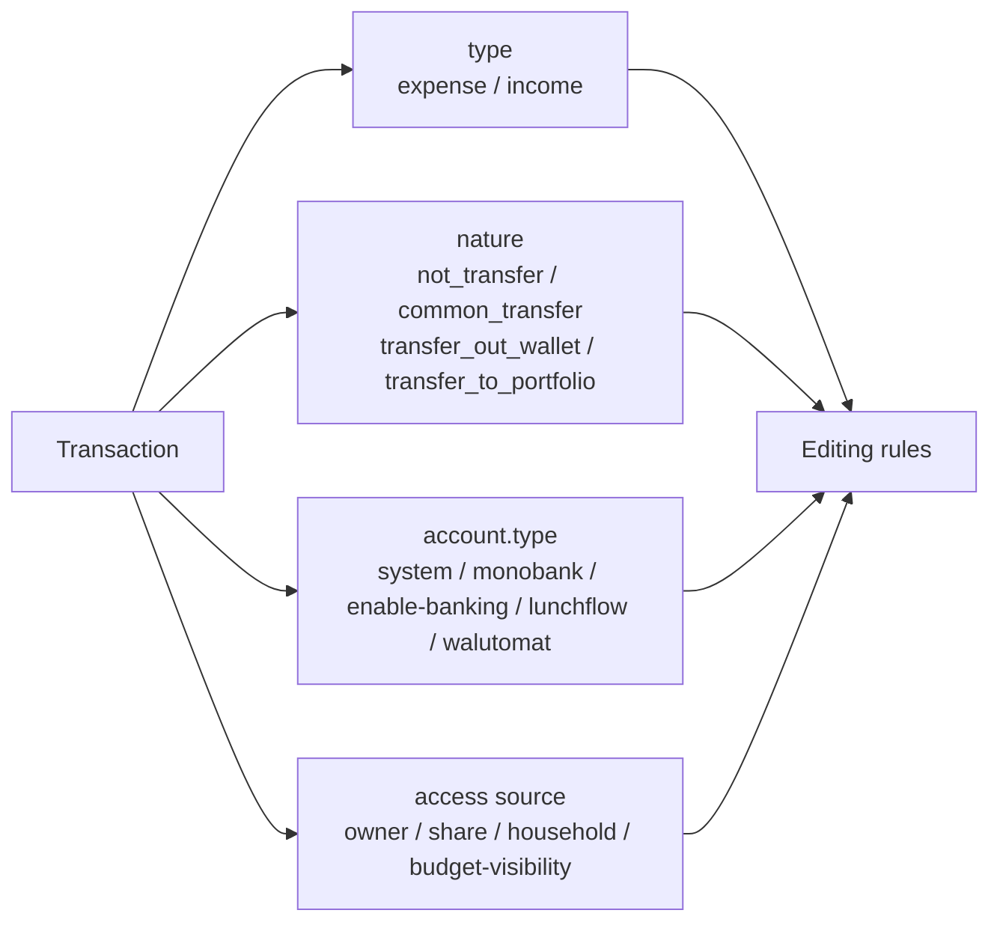

You should always ask these four questions in this order before deciding what a user can do:

1. **Who is the caller relative to this transaction?** Owner, write-share recipient, read-share recipient, household member, budget-visibility-only viewer.
2. **What is the account type?** System (fully editable) or external (most fields locked).
3. **Is the transaction part of a link?** Transfer (with another tx), portfolio link, refund link, subscription link, split parent/child.
4. **What is the transaction's own type?** Expense vs income — usually free to flip on system accounts, locked on external accounts.

If any earlier question yields a restrictive answer, the later answers don't matter.

---

## 2. Access Source — Who Can Edit At All

| Access source                   | Backend tag                                               | What can be edited                                                                                                                                                                            |
| ------------------------------- | --------------------------------------------------------- | --------------------------------------------------------------------------------------------------------------------------------------------------------------------------------------------- |
| Owner                           | `ACCESS_SOURCES.owner`                                    | Everything the type / nature / account allow.                                                                                                                                                 |
| Shared account, write or manage | `ACCESS_SOURCES.share` with permission `write` / `manage` | Fields only (note, amount, time, category, tags, payment type, splits). **Cannot** create/discard transfers, link/unlink refunds, move tx to another account.                                 |
| Shared account, write-scope=own | Same, with `transactionsWriteScope: 'own'`                | Same as above, but **only on transactions they themselves created**. Rows created by the owner are read-only to them.                                                                         |
| Shared account, read            | `ACCESS_SOURCES.share` with permission `read`             | Read-only.                                                                                                                                                                                    |
| Household                       | `ACCESS_SOURCES.household`                                | Same as `share`, gated by the same permission set.                                                                                                                                            |
| Budget visibility only          | `ACCESS_SOURCES.budget`                                   | **Always read-only.** The transaction is visible because the budget it's attached to was shared; the underlying account is not. The dialog renders as a "Details" view with no Submit button. |
| Revoked share                   | (no longer accessible)                                    | The API returns 404. The tx disappears from the user's view. There is no "soft" revoked state — this is intentional, not a gap to close.                                                      |

### Decision tree

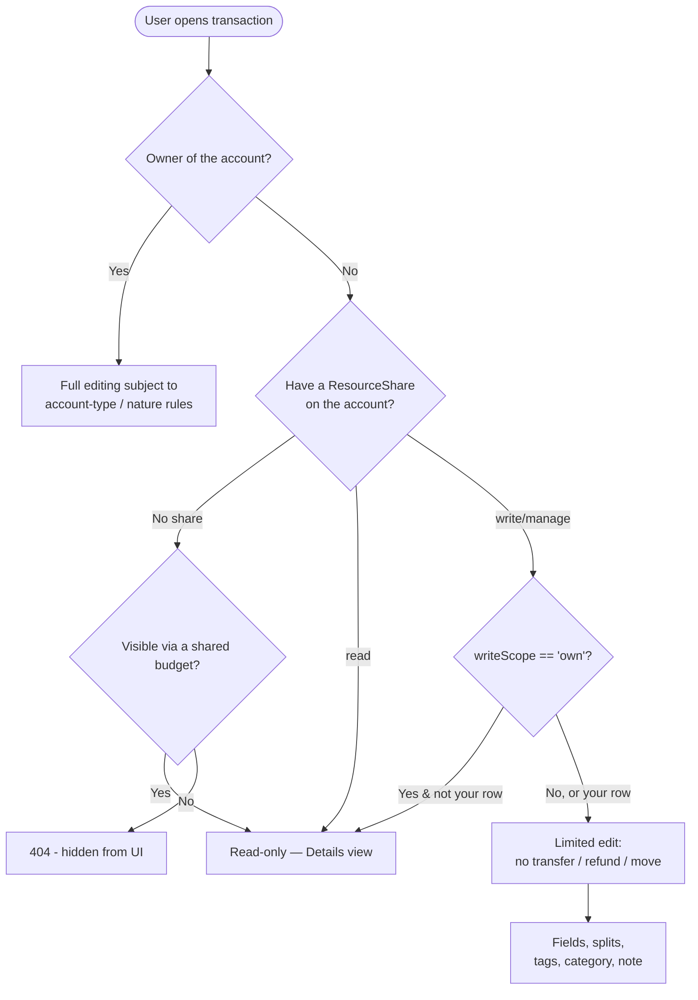

---

## 3. Account Type — System vs External

A "system" account is a manual account the user types into. Anything else (`monobank`, `enable-banking`, `lunchflow`, `walutomat`) is a synced external account whose transactions are fetched from a third-party provider.

External-account transactions are heavily locked because the source of truth is the bank, not us. The backend explicitly forbids changing any of:

```
amount, time, transactionType, accountId
```

(`EXTERNAL_ACCOUNT_RESTRICTED_UPDATION_FIELDS`)

What the user **can** change on an external transaction:

- `note`
- `paymentType`
- `categoryId`
- Tags
- Whether it participates in a transfer link (but the side that's on the external account always keeps its sign — see [Transfers](#5-transfers))
- Refund linking (subject to standard rules)
- Splits

The frontend mirrors these rules by disabling the corresponding form fields and hiding the Delete button.

---

## 4. State Machine — The States and Their Transitions

Transactions move between four **natures**. The `transactionType` (expense vs income) is an independent axis — see [§4.5](#45-type-axis-expense--income) below.

Rather than one tangled diagram, here is the transition map split into one tiny diagram per movement.

### 4.1 The four natures at a glance

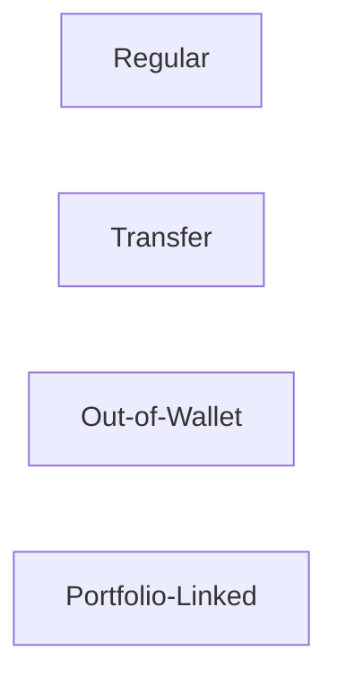

| Nature               | Meaning                                                                                                      |
| -------------------- | ------------------------------------------------------------------------------------------------------------ |
| **Regular**          | Standalone single transaction. No links.                                                                     |
| **Transfer**         | Two paired transactions sharing a `transferId`. One leg is `expense`, the other `income`.                    |
| **Out-of-Wallet**    | One-legged "transfer" with no opposite — money leaving or entering the system without a counterpart account. |
| **Portfolio-Linked** | Locked. Only the portfolio API can mutate. Only "Unlink from Portfolio" is allowed from the UI.              |

### 4.2 Regular ⇄ Transfer

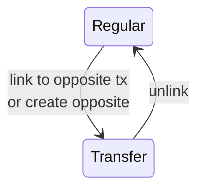

The interesting rules live here — see [§5](#5-transfers) for the asymmetry issue and the proposed "unlink-first" rule.

### 4.3 Regular ⇄ Out-of-Wallet

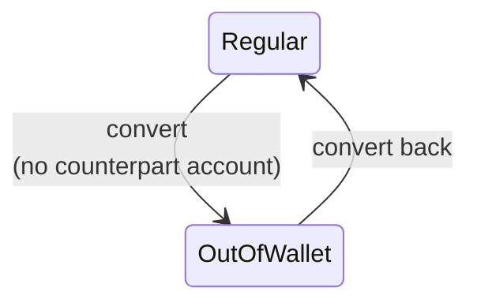

Symmetric, no surprises. See [§6](#6-out-of-wallet-transfers).

### 4.4 Portfolio-Linked (a separate world)

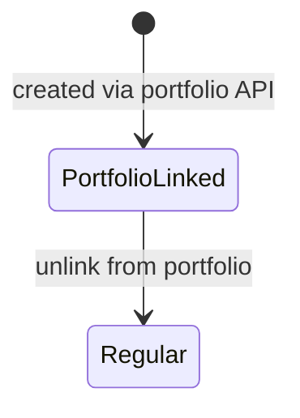

Portfolio-linked transactions cannot be created from the regular Edit dialog — only the portfolio API produces them. While linked, all edits are blocked. See [§7](#7-portfolio-linked-transactions).

### 4.5 Type axis (expense ⇄ income)

The type axis is **independent** of nature. On any Regular or Out-of-Wallet transaction:

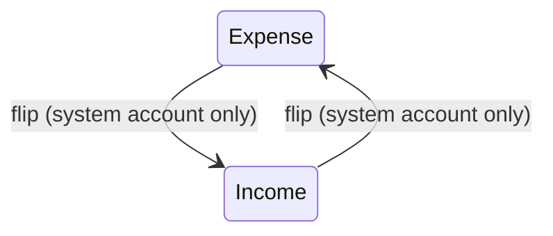

- On **system accounts**, flipping is free.
- On **external accounts** (monobank, enable-banking, lunchflow, walutomat), the type is **locked** — it reflects what the bank reported.
- On a **Transfer**, the type of each leg is determined by which leg you're looking at; flipping a leg's type does not behave intuitively today and is the topic of [§5.2](#52-why-the-asymmetry-feels-confusing).

| State                 | `transactionType` | `transferNature`        | Notes                                             |
| --------------------- | ----------------- | ----------------------- | ------------------------------------------------- |
| Regular expense       | `expense`         | `not_transfer`          | Default standalone transaction.                   |
| Regular income        | `income`          | `not_transfer`          | Default standalone transaction.                   |
| Transfer expense leg  | `expense`         | `common_transfer`       | Source side of a paired transfer.                 |
| Transfer income leg   | `income`          | `common_transfer`       | Destination side of a paired transfer.            |
| Out-of-wallet expense | `expense`         | `transfer_out_wallet`   | Money leaving the system, no destination account. |
| Out-of-wallet income  | `income`          | `transfer_out_wallet`   | Money entering the system, no source account.     |
| Portfolio-linked      | either            | `transfer_to_portfolio` | Locked. Only the portfolio API can mutate.        |

In addition to the state, a transaction can carry one of the following **link tags** that further restrict editing:

| Tag                 | Source                                                   | Effect on editing                                              |
| ------------------- | -------------------------------------------------------- | -------------------------------------------------------------- |
| Refund: original    | Has `refundedByTxIds` populated via `RefundTransactions` | Cannot be deleted while linked; standard fields editable.      |
| Refund: refund leg  | Has `refundsTxId` populated                              | Same as above. Mutually exclusive with being an "original".    |
| Subscription-linked | Row in `SubscriptionTransactions`                        | No edit restriction today; surfaced in UI only.                |
| Split parent        | Has child splits                                         | Cannot become a transfer until splits are removed.             |
| Split child         | Has `parentTxId`                                         | Edited via the split-management API, not the main edit dialog. |

---

## 5. Transfers

Transfers are the most complex state because they are **two transactions stitched together by a shared `transferId`**. Editing a transfer affects both legs simultaneously.

### 5.1 Current behavior

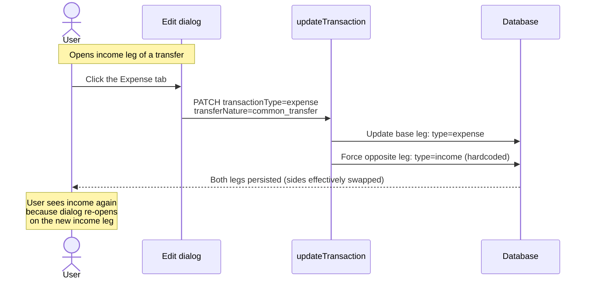

The hardcode is in `packages/backend/src/services/transactions/update-transaction.ts` (line 329), inside `updateTransferTransaction()`:

```ts
transactionType: TRANSACTION_TYPES.income, // opposite leg, always
```

This means that whichever leg you edit, the _other_ leg is always written as `income`. There is no path that produces "two-expense-legs" or "two-income-legs" — by design. But it also means the user cannot smoothly "flip" a transfer's income side into an expense, because doing so just swaps which side is which.

The historical guard that used to block this entirely is still in the file, commented out (lines 98–113). Removing it permitted income-side edits but did not introduce a clean flip path.

### 5.2 Why the asymmetry feels confusing

From the user's perspective, opening the **expense** side of a transfer and converting it back to a standalone expense "just works" (unlink + keep type=expense). Opening the **income** side and trying to convert it to a standalone expense produces a swap, not a flip, because the form's "Expense" button sends `transactionType: expense` while the backend's transfer-update code still treats the chosen side as the new base and forces the other to income.

### 5.3 Proposed rule: always unlink first

The cleanest fix is to require an explicit **unlink** step before changing type on a transfer.

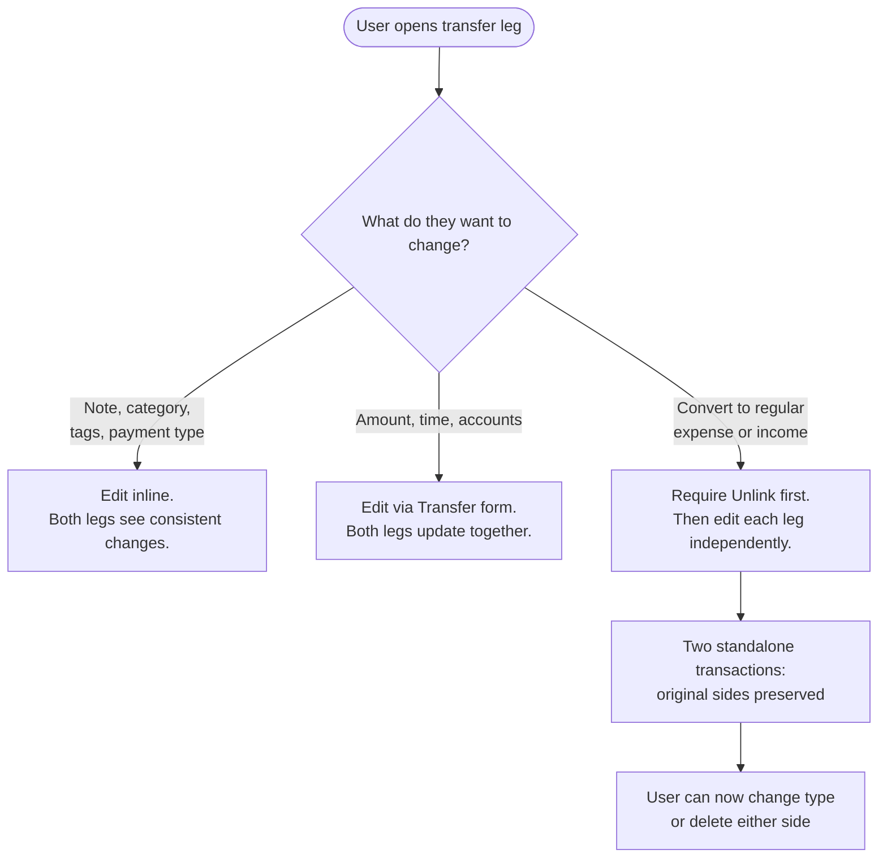

Concrete rules under this proposal:

- The Edit dialog for a transfer-leg shows the three type tabs (**Expense / Income / Transfer**) but **Expense and Income are visually disabled** with a tooltip: "Unlink first to convert this side."
- The "Unlink" button becomes the primary affordance for transitioning out of a transfer.
- After unlinking, the user is left with two standalone transactions; they edit each one in its own dialog, with no implicit side-swapping.
- This eliminates the entire "which side wins on flip" code path and lets us delete the hardcoded `TRANSACTION_TYPES.income` on the opposite leg without consequences.

Tradeoff: one extra click for users who want to convert a transfer back to a single regular transaction. In exchange we remove a class of confusing implicit swaps.

### 5.4 External-account leg

If either leg sits on an external account, the editing tabs respect the existing external-account lock: the side on the external account keeps its type, and the user cannot flip it. The "Unlink first" rule still applies. After unlinking, the external-side transaction becomes a standalone external tx — fully usable for the limited-edit set (note, category, tags, payment type), with its type, amount, time, and account remaining locked, same as any external transaction.

---

## 6. Out-of-Wallet Transfers

`transfer_out_wallet` is a one-legged "transfer" with no opposite transaction. Editing rules:

- Type is editable (`expense` ⇄ `income`) on system accounts.
- Can be converted back to `not_transfer` (regular tx) freely.
- Can be converted to `common_transfer` by linking to (or creating) an opposite leg.
- On external accounts: locked the same way regular transactions are.

There is no asymmetry concern here because there is no opposite leg to fight with.

---

## 7. Portfolio-Linked Transactions

Any transaction with `transferNature === transfer_to_portfolio` is fully locked in the regular Edit dialog:

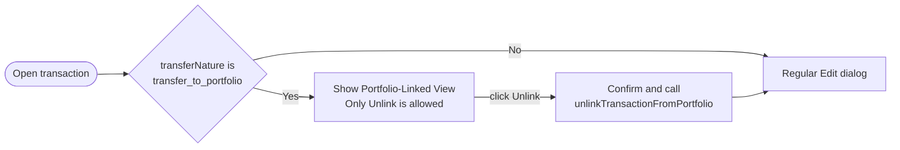

- The backend rejects any update payload on these rows with a `ValidationError` (`update-transaction.ts:92`).
- The frontend swaps the dialog content out entirely (`dialog-content.vue:82`).
- All changes to the underlying numbers must go through the portfolio API (buy/sell/dividend etc.) — those operations may then update the linked regular tx as a side effect.

This state is intentionally the most restrictive. The end-user message should be: "This transaction is tied to a portfolio investment. To change it, edit the underlying investment, or unlink it from the portfolio first."

---

## 8. Refund and Subscription Links

### Refund linking

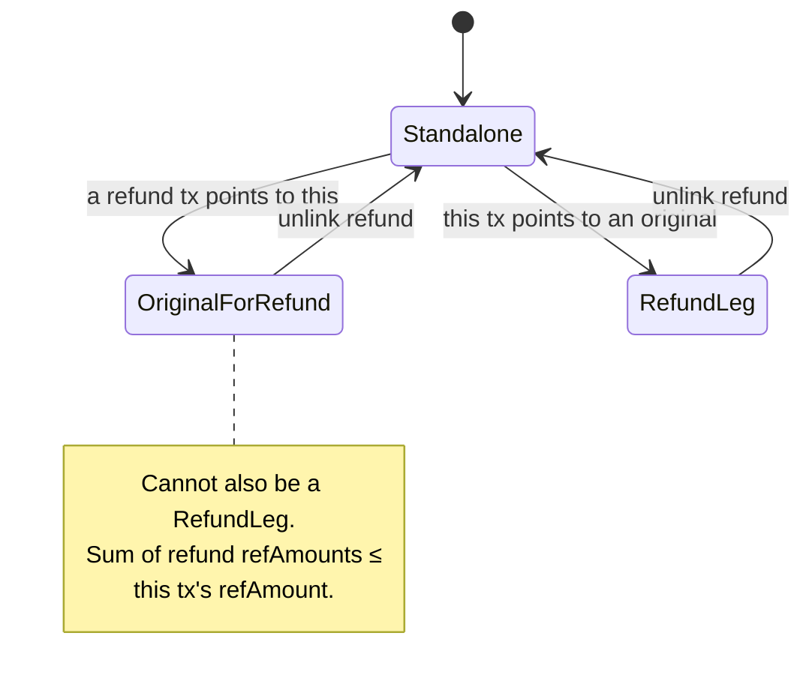

- An expense tx can be marked as the **original** that was later refunded; an income tx can be marked as the **refund leg** of that original.
- The two roles are mutually exclusive on a single tx.
- The frontend hides the refund-link section entirely for users on a shared account (only the owner can link refunds — `assertSharedWritePhase1Guards`).
- All other field edits remain available while a refund link exists.

### Subscription linking

- Linking a tx to a subscription does **not** lock the tx for editing; it is metadata only.
- Unlinking via the subscription detail view removes the row in `SubscriptionTransactions`.

---

## 9. Splits

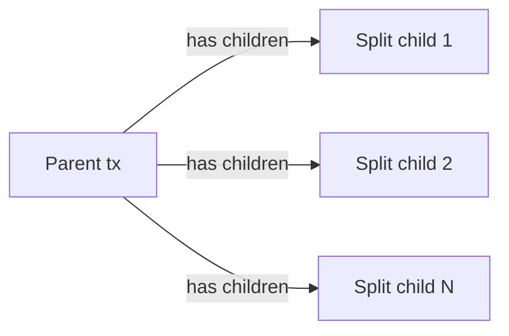

- A split parent's `amount` must equal the sum of its children (enforced server-side).
- A parent that has children **cannot be converted to a transfer**. Server-side, attempting to do so deletes the children silently. The UI **must** show an explicit confirmation dialog before the conversion is allowed — never silently destroy a user's split data.
- Children are edited via the split-management API, not the main Edit dialog.
- All other field edits on the parent (note, time, category, account) propagate freely.

---

## 10. Summary: Per-State Editing Matrix

| State                    | Type can flip                | Can convert to transfer                   | Can convert from transfer | Can be deleted    | Can be split     | Can be refund-linked |
| ------------------------ | ---------------------------- | ----------------------------------------- | ------------------------- | ----------------- | ---------------- | -------------------- |
| Regular expense (system) | ✅                           | ✅                                        | n/a                       | ✅                | ✅               | ✅ (as original)     |
| Regular income (system)  | ✅                           | ✅                                        | n/a                       | ✅                | ✅               | ✅ (as refund leg)   |
| Regular tx (external)    | ❌                           | ✅ (other side may be system or external) | n/a                       | ❌                | ✅               | ✅                   |
| Transfer leg (system)    | After unlink only (proposed) | n/a                                       | ✅ via unlink             | After unlink only | ❌ (split first) | ❌                   |
| Transfer leg (external)  | ❌                           | n/a                                       | ✅ via unlink             | ❌                | ❌               | ❌                   |
| Out-of-wallet (system)   | ✅                           | ✅                                        | n/a                       | ✅                | ✅               | ✅                   |
| Portfolio-linked         | ❌                           | ❌                                        | n/a                       | ❌                | ❌               | ❌                   |
| Shared (write recipient) | Per type rules               | ❌                                        | ❌                        | Per row ownership | ✅               | ❌                   |
| Shared (read recipient)  | ❌                           | ❌                                        | ❌                        | ❌                | ❌               | ❌                   |
| Budget-visible only      | ❌                           | ❌                                        | ❌                        | ❌                | ❌               | ❌                   |
| Revoked share            | (404 — invisible)            | —                                         | —                         | —                 | —                | —                    |

---

## 11. Proposed UX Rules (Target State)

The following are the rules I propose the app explicitly enforce, both to make behavior predictable and to make this document a useful end-user reference.

1. **Type changes on a transfer require an explicit "Unlink" step.** The Edit dialog disables the Expense/Income tabs for transfer legs and surfaces "Unlink" as the primary action for state changes. (See [§5.3](#53-proposed-rule-always-unlink-first).)
2. **Portfolio-linked transactions are read-only.** The only allowed action is "Unlink from Portfolio". All numeric edits go through the portfolio API.
3. **External-account transactions are read-mostly.** The only editable fields are note, category, tags, payment type. The type, amount, time, and account are locked.
4. **Budget-visible transactions are read-only.** A user who can see a transaction only because of a shared budget cannot edit it.
5. **Shared-account write recipients have a restricted toolkit.** They can edit fields, manage tags and splits, but cannot create/discard transfer links, link/unlink refunds, or move a transaction to a different account.
6. **Splits and transfers are mutually exclusive.** Converting a split parent to a transfer requires removing the splits first, with a confirmation dialog. The current silent deletion should be replaced with an explicit prompt.

---

## 12. Where This Lives in Code

For engineers extending these rules, the canonical files are:

| Concern                                       | File                                                                                                             |
| --------------------------------------------- | ---------------------------------------------------------------------------------------------------------------- |
| Backend update entry                          | `packages/backend/src/services/transactions/update-transaction.ts`                                               |
| Transfer link/unlink                          | `packages/backend/src/services/transactions/link-transfer/`, `.../unlink-transfer/`                              |
| External-account guard                        | `update-transaction.ts:51–84` (`validateTransaction`)                                                            |
| Portfolio-link guard                          | `update-transaction.ts:92`                                                                                       |
| Shared-access guards                          | `packages/backend/src/services/sharing/auth/authorize-account-write.service.ts`, `assertSharedWritePhase1Guards` |
| Frontend Edit dialog                          | `packages/frontend/src/components/dialogs/manage-transaction/dialog-content.vue`                                 |
| Type selector (the visible asymmetry surface) | `packages/frontend/src/components/dialogs/manage-transaction/components/type-selector.vue`                       |
| Form-payload preparation                      | `packages/frontend/src/components/dialogs/manage-transaction/helpers/prepare-tx-updation-params.ts`              |
| Portfolio-linked dialog                       | `packages/frontend/src/components/dialogs/manage-transaction/portfolio-linked-view.vue`                          |

---

## 13. Status

This document captures the **current behavior** as of the date below and a **proposed direction** (see [§11](#11-proposed-ux-rules-target-state)). The proposed rules are not yet implemented; treat divergence between code and this document as bugs to file, not as code being authoritative.

_Last updated: 2026-05-21._
