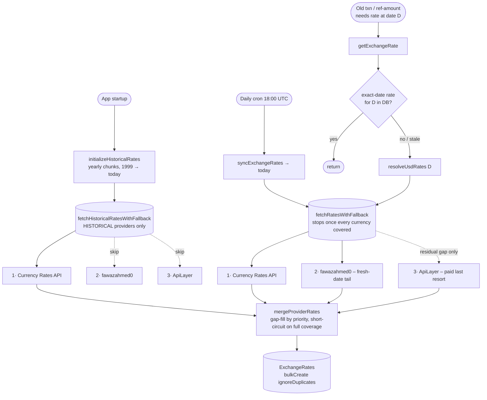

# Exchange Rates – how rates actually get loaded

Quick doc on how currency rates land in the `ExchangeRates` table – which provider does what, how the daily sync stays fresh, how the full historical archive gets backfilled, and what happens when you edit a transaction dated 12 years ago in some exotic currency. Also: why ApiLayer is deliberately skipped on the historical path and only fires as a paid last resort.

Everything is stored as `USD → X`. Any other pair (EUR/GBP, UAH/PLN, whatever) is derived in `getExchangeRate` by going through USD. Keeps the table small and the merge logic sane.

---

The providers

There are three, queried in priority order:

1. **Currency Rates API** – primary. Custom self-hosted service backed by ECB + NBU data. ~38 currencies. Has a real time-series endpoint, so a whole year of history is one HTTP call. Goes back to 1999-01-04.
2. **fawazahmed0/exchange-api** (source `fawaz-currency-api`) – secondary. Free, CDN-hosted, no API key, no rate limit. Covers 200+ currencies – the entire exotic long tail plus metals and crypto. Same `USD → X` convention as ours (lowercase codes). Single-date only, and its data floor is `2024-03-02`. This is the provider that keeps the fresh-date long tail covered without touching the paid dependency.
3. **ApiLayer (Fixer)** – last resort. Paid, external, 150+ currencies. Now reached only when the two providers above leave a gap – i.e. mostly pre-2024 exotic dates on the on-demand path. It's never removed: it's the guaranteed fallback that covers dates and currencies fawazahmed0 can't.

The registry (`providers/registry.ts`) does something slightly non-obvious here: it's a **gap-filling merge**, not first-success-wins, and it's **coverage-gated**. It queries providers in priority order, each lower-priority provider only contributing currencies the higher ones didn't supply, and it **stops as soon as every enabled currency has a rate**. So on a fresh date, Currency Rates API covers the mainstream basket and fawazahmed0 fills the tail – coverage is complete, the chain short-circuits, and the paid ApiLayer fetch never fires. ApiLayer is only reached when a residual gap remains after both (predominantly pre-2024 exotic dates fawazahmed0's floor excludes).

---

The three load paths



---

1. Historical backfill – runs on app startup

Fires once per process from `background-jobs.ts` → `initializeHistoricalRates()`. Non-blocking, so a slow backfill never delays app boot. Failure here doesn't block startup either – the daily cron eventually catches up.

The range is `1999-01-04` (earliest ECB data) through today, processed in **yearly chunks** to keep memory under control on the bulk insert. Each chunk goes through `fetchHistoricalRatesWithFallback`, which only queries providers that opt in via `supportsHistoricalDataLoading=true` – currently just Currency Rates API. Both fawazahmed0 and ApiLayer are intentionally skipped here (neither exposes a time-series range endpoint); more on that below.

The whole thing is idempotent. Re-runs insert nothing thanks to `bulkCreate({ ignoreDuplicates: true })` against the unique `(baseCode, quoteCode, date)` constraint, so on every restart it's a no-op after the first successful run.

If no historical provider is available at startup (Docker still booting, network blip), it retries 5× with 30s gaps. Still nothing – it gives up quietly, and the daily cron will fill in new days going forward.

---

2. Daily sync – the cron

`crons/exchange-rates/index.ts`, fires at **18:00 UTC** every day. That's after ECB's ~16:00 CET publish, so the rates are actually there when we ask.

It calls `syncExchangeRates` → `ensureRatesForDate(today)` (the full-sync entry). Currency Rates API handles the ~38 mainstream currencies; fawazahmed0 fills the long tail for the same fresh date. Between the two, every enabled currency is covered, so the coverage-gated merge short-circuits before reaching ApiLayer – the daily sync stays entirely on free providers.

fawazahmed0 is fetched from an **immutable dated URL** so the CDN can cache it correctly:

- jsDelivr (primary): `https://cdn.jsdelivr.net/npm/@fawazahmed0/currency-api@{YYYY-MM-DD}/v1/currencies/{base}.min.json`
- Cloudflare Pages (fallback): `https://{YYYY-MM-DD}.currency-api.pages.dev/v1/currencies/{base}.min.json`

If today's file isn't published yet at fetch time, fawazahmed0 simply returns nothing and the chain proceeds to ApiLayer, which serves the real requested date. It deliberately has **no yesterday-fallback** (unlike Currency Rates API): a stale whole-basket result would be stored under today's date, satisfy the comprehensiveness gate, and suppress ApiLayer – silently pinning day-old rates. And for any date before its `2024-03-02` floor it makes no request at all and returns nothing – so pre-2024 rates come from ApiLayer, never fawazahmed0.

---

3. On-demand backfill – old transactions

This is the path most people don't think about. When you edit (or create) a transaction dated five years ago, the ref-amount calculation needs the historical rate. `getExchangeRate({ userId, date, baseCode, quoteCode })` runs:

1. `resolveUsdRates({ codes: [base, quote], date })` resolves each currency to one of three kinds: `exact` (a row for that exact date), `fallback` (no exact row, so the most-recent row from another date is returned as an approximation – and logged), or `missing` (nothing at all). The three kinds are a discriminated type, so a fallback can never be silently mistaken for a real exact-date rate. It reads what's stored and, if a leg isn't `exact`, tries to fill the gap (see below) and re-reads – returning the resolved lookups so the caller never re-queries.
2. Compute the cross-rate via USD. If a needed currency is still `missing`, throw – it genuinely isn't available from any provider for that date.

`resolveUsdRates` is where the "do I actually need to hit a provider?" decision lives, and it asks two precise questions:

- **Coverage** – are the requested currencies already present as exact-date rows? If so, do nothing.
- **Comprehensiveness** – has the date already been fetched comprehensively? `isDateComprehensivelyFetched` answers yes if a **whole-basket** provider – fawazahmed0 or ApiLayer – has a row for the date. Both answer per-date with their entire basket, so once either has run, a currency still absent is genuinely unavailable for that date and re-fetching is futile – skip, and the caller uses its fallback. Currency Rates API is deliberately not a signal: it only ever supplies its ~38 currencies, so its rows never prove the exotic tail was attempted. On a post-2024 date fawazahmed0 is the signal (ApiLayer usually never runs, since the free providers cover the tail); below the 2024-03-02 floor fawazahmed0 makes no request, so ApiLayer is the sole signal there – which is correct, as it's the only source for old exotic dates.

When a gap remains, the fetch walks the same priority chain as the daily sync: Currency Rates API → fawazahmed0 → ApiLayer, stopping at full coverage. For a fresh-date exotic currency, fawazahmed0 answers and ApiLayer is never touched. For a **pre-2024** exotic date, fawazahmed0's floor rules it out entirely, so ApiLayer is the only source that can fill the gap – and this is exactly the case where paying for one single-date request is worth it.

One edge worth knowing: if a date genuinely reaches ApiLayer (a pre-2024 exotic date) and ApiLayer returns **zero** rows (it was down, rate-limited, or has no API key configured), no ApiLayer-sourced row exists and the date isn't fully covered, so the next lookup re-fetches. For a transient outage that's the intended behaviour – retry until ApiLayer answers. For a deployment without an ApiLayer key the exotic currency is unobtainable regardless, so the repeat fetch (bounded by the 30s dedup) is harmless.

Two guards keep this from melting things under load – bulk-editing old transactions, stats jobs sweeping years of history, that kind of thing:

- A **4-hour Redis cache** inside `getExchangeRate`, keyed globally by `(date, baseCode, quoteCode)`. The cross-rate `USD→EUR on 2020-03-15` is the same number for everyone – keying by user would store N identical copies. Sits _after_ the user-currency auth check and _after_ the custom-rate-override branch, so neither gate is bypassed by a hit. The per-user custom rate path (`liveRateUpdate=false`) deliberately doesn't cache here – it's resolved from the DB on every call. Only results where **both** legs resolved to an exact-date rate are cached; a fallback (stale rate from another date) is never cached, so once the real rate for the date lands it's served immediately instead of being masked by a cached approximation for up to 4h.
- A **30-second in-flight dedup** on `fetchAndStoreRatesForDate`, keyed by date. A hundred parallel callers needing the same date trigger exactly one upstream fetch.

---

Why fawazahmed0 and ApiLayer are skipped on the historical path

Neither provider sets `metadata.supportsHistoricalDataLoading` (defaults falsy), so the historical registry filters both out. Different reasons for each.

**fawazahmed0 – no time-series endpoint, and a hard data floor.** Its API answers a single date at a time (`@{YYYY-MM-DD}`), so a 1999→today backfill would be ~10,000 separate CDN requests instead of Currency Rates API's handful of year-range calls. And it has nothing before `2024-03-02` anyway, so it couldn't fill the deep archive even if we hammered it. On the fresh-date paths, one dated request per day is exactly the shape it's good for; as a bulk historical source it's the wrong tool.

**ApiLayer – cost, no range endpoint, and it's not its job.**

- **Cost.** ApiLayer is the only paid dependency – keyed via `API_LAYER_API_KEYS`, with cheap tiers capping monthly requests in the low thousands. A full 1999→today backfill is ~10,000 days. One quota-charged request per day per key would drain a month's quota on a single startup. And because `bulkCreate ignoreDuplicates` means most of those requests would re-insert data we already have, every restart would re-burn it for nothing.
- **No time-series endpoint here.** Currency Rates API exposes a proper `start..end` range endpoint – a whole year of history is a single HTTP call. ApiLayer's Fixer endpoint we use is single-date only (`/fixer/{date}`). So historical via ApiLayer would mean one quota hit per day – strictly worse than the primary that already covers the same mainstream currencies for free.
- **It's not the job ApiLayer exists for.** ApiLayer's whole purpose in this system is to be the guaranteed backstop for dates and currencies the free providers can't reach – chiefly the **pre-2024 exotic tail** (before fawazahmed0's floor). Those old exotic rates are rarely actually queried, and when they _are_ (someone edits an old transaction in a non-ECB currency dated before 2024), the on-demand path in `getExchangeRate` pulls ApiLayer for that single date. So ApiLayer still fills historical gaps – just lazily, one date at a time, when the data is actually needed.

---

Gap reporting

After every daily/on-demand fetch, `registry.fetchRatesWithFallback` emits a `logger.error` (→ Sentry) on these signals (1 and 3 via its `reportDegradedSync` step, 2 inline):

1. **Provider degraded** – any registered provider failed, returned nothing, or was unavailable, even if the others covered the gap. A provider skipped because the requested date predates its data floor is NOT counted – declining by design is not degradation. If the primary specifically degraded, the message keeps the legacy `[ALERT:CURRENCY_RATES_API_FAILED]` keyword so existing monitoring rules stay valid.
2. **fawazahmed0 gap** – `[ALERT:FAWAZ_CURRENCY_API_GAP]`. Fires when, for a **requested** date `>= 2024-03-02`, an enabled currency had to be filled by **ApiLayer**. Rationale: fawazahmed0 is supposed to have every currency for any post-2024 date, so falling back to the paid provider is an anomaly worth surfacing. Deliberately narrow to avoid double-reporting: a fawazahmed0 fetch _failure_ is already covered by signal 1, and a currency missing _entirely_ by signal 3 – this alert only means "fawazahmed0 ran but lacked a rate the paid fallback had".
3. **Coverage gap** – an enabled currency (from the `Currencies` table) is absent from the merged result, meaning some user's currency just didn't get a fresh rate today. The "enabled" set excludes `NON_CURRENCY_CODES` (precious metals, ISO fund codes like `BOV`/`MXV`/`USN`) – no provider quotes those, so counting them would make full coverage unreachable, defeat the ApiLayer early-stop, and fire this alert on every sync.

The historical backfill reports degradation the same way, but skips the per-date coverage check – the long tail is expected to be missing across years, and alerting on it would be pure noise.

---

Schema bits worth knowing

- Table `exchange_rates`, unique on `(baseCode, quoteCode, date)`. There's a `source` column recording which provider supplied each row (added in migration `20260520000000-add-source-to-exchange-rates.ts`), useful when debugging "why is this rate weird".
- The `source` column is a plain `VARCHAR` with **no DB-level CHECK constraint** – it was dropped in `20260720000000-drop-exchange-rates-source-check.ts`. The TypeScript enum `EXCHANGE_RATE_PROVIDER_TYPE` (`packages/shared/src/types/enums.ts`) is the single source of truth for the valid provider strings, so adding a provider is a **code-only** change with no accompanying migration.
- Every row stores `baseCode = 'USD'`. Anything that looks like a non-USD pair on the frontend is computed at read time.

---

Config

```bash
API_LAYER_API_KEYS=key1,key2,key3        # comma-separated; rotated automatically on 429
CURRENCY_RATES_API_URL=http://currency-rates-api:8080
```

`currency-rates-api` (image `letehaha/currency-rates-api`) is self-hosted in docker-compose. fawazahmed0 needs **no configuration at all** – it's a keyless public CDN, so there's nothing to set. ApiLayer is the only external paid dep, and as covered above it's only used where it actually earns its keep.

---

Notes – decisions & rejected alternatives

Short rationale for the non-obvious choices, so they don't get re-litigated:

- **ApiLayer is coverage-gated, not always-called.** The registry stops the priority chain the moment every enabled currency is covered, so on fresh dates (where fawazahmed0 covers the tail) the paid provider never fires. Keeping the old always-continue-to-ApiLayer behaviour was rejected – it would pay for the exotic basket every single day even though the free CDN already carries it. ApiLayer stays wired in as the guaranteed last resort; it's just not reached until a real gap remains.
- **Dropped the DB CHECK constraint instead of amending it per provider.** The `source` whitelist previously lived in a Postgres CHECK, which meant every new provider needed a migration just to enlarge the allowed set – and the enum and the constraint could silently drift. Dropping the CHECK and treating `EXCHANGE_RATE_PROVIDER_TYPE` as the sole source of truth makes adding a provider a code-only change and removes the drift surface entirely.
- **fawazahmed0 is fetched via the dated `@{YYYY-MM-DD}` URL, never `@latest`.** jsDelivr caches `@latest` for up to ~24h, so it can serve yesterday's basket under today's name. The dated URL is immutable, so it's both correct and safely cacheable. Before today's file is published the provider simply returns nothing and the chain falls through to ApiLayer – deliberately no yesterday-fallback (see the comprehensiveness-gate rationale above).
- **fawazahmed0 is excluded from the historical backfill.** It has no time-series/range endpoint (one request per date) and no data before `2024-03-02`, so it can't populate the deep archive – Currency Rates API's range endpoint is the only viable historical source. fawazahmed0 earns its place on the daily/on-demand fresh-date paths instead.
- **The `2024-03-02` floor deliberately keeps ApiLayer as the pre-2024 source.** Below the floor fawazahmed0 makes no request, so the coverage-gated chain falls through to ApiLayer for old exotic dates. That's intended: the free CDN owns the fresh tail, the paid provider owns the (rarely queried, one-date-at-a-time) old tail.
- **Comprehensiveness gate keys off a whole-basket provider's row (fawazahmed0 or ApiLayer), not full coverage.** The gate asks "did a provider that answers the entire basket per date already run?" – if so, a still-absent currency is genuinely unavailable and re-fetching is futile. Keying off _full coverage of every enabled currency_ was rejected: a currency no provider carries (a rare enabled ISO code outside all three baskets) leaves coverage permanently incomplete, so that gate would re-fetch the date forever. Currency Rates API is excluded as a signal because it only ever carries its ~38 currencies – its rows never prove the tail was attempted. A `count > N` threshold was also rejected – N is coupled to how many currencies each provider happens to cover, so it silently breaks if coverage changes. (The merge's early-stop still uses full coverage, but only to decide whether to _skip the paid ApiLayer call_; the comprehensiveness gate still bounds ApiLayer to at most one call per date even when a never-carried currency keeps that early-stop from firing.)
- **No durable "already tried this date" marker.** A Redis/DB record written on every fetch attempt (to remember even a zero-row ApiLayer response) was considered and rejected: it would suppress the retry we _want_ during a transient ApiLayer outage, and for a no-key deployment the currency is unobtainable anyway. The comprehensiveness gate self-records via the fawazahmed0 / ApiLayer basket row.
- **No "currency added after the date was synced" tracking.** Not needed: `Currencies` is seeded once with the full ISO set and has no timestamps (toggled via `isDisabled`, never added incrementally), so that state isn't reachable.
- **Cross-rate cache is global, keyed `(date, base, quote)` without `userId`.** The conversion is user-independent; per-user keys would store N identical copies. The per-user custom-rate override (`liveRateUpdate=false`) is the lone user-specific case and deliberately skips this cache.
- **Only exact-on-both-legs results are cached; fallbacks are recomputed every call.** Caching a fallback under the requested date's key was rejected: with the 4h TTL it would keep serving a stale approximation even after the real rate for that date lands (the worst case being "today" queried before the daily publish, then again within 4h). Recomputing a fallback is cheap – the comprehensiveness gate stops it from hammering providers and the 30s dedup collapses bursts – so correctness wins over the marginal cache hit.
- **Dedup is in-process (per pod), not distributed.** Two pods can each run one fetch for the same date; `bulkCreate ignoreDuplicates` makes the overlap harmless, so a cross-pod lock isn't worth the complexity.
