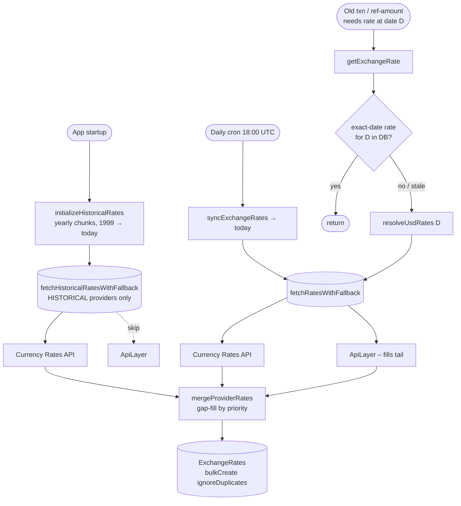

# Exchange Rates – how rates actually get loaded

Quick doc on how currency rates land in the `ExchangeRates` table – which provider does what, how the daily sync stays fresh, how the full historical archive gets backfilled, and what happens when you edit a transaction dated 12 years ago in some exotic currency. Also: why ApiLayer is deliberately skipped on the historical path.

Everything is stored as `USD → X`. Any other pair (EUR/GBP, UAH/PLN, whatever) is derived in `getExchangeRate` by going through USD. Keeps the table small and the merge logic sane.

---

The providers

There are two, queried in priority order:

1. **Currency Rates API** – primary. Custom self-hosted service backed by ECB + NBU data. ~38 currencies. Has a real time-series endpoint, so a whole year of history is one HTTP call. Goes back to 1999-01-04.
2. **ApiLayer (Fixer)** – secondary. Paid, external, 150+ currencies. This is the one that covers the long tail – all those exotic currencies the ECB-based primary simply doesn't publish.

The registry (`providers/registry.ts`) does something slightly non-obvious here: it's a **gap-filling merge**, not first-success-wins. Every available provider gets queried in priority order, but a lower-priority provider only contributes currencies the higher-priority ones didn't supply. So even on a happy day when Currency Rates API succeeds, the chain still continues to ApiLayer – otherwise the ~110 exotic currencies that only ApiLayer covers would go permanently stale.

---

The three load paths



---

1. Historical backfill – runs on app startup

Fires once per process from `background-jobs.ts` → `initializeHistoricalRates()`. Non-blocking, so a slow backfill never delays app boot. Failure here doesn't block startup either – the daily cron eventually catches up.

The range is `1999-01-04` (earliest ECB data) through today, processed in **yearly chunks** to keep memory under control on the bulk insert. Each chunk goes through `fetchHistoricalRatesWithFallback`, which only queries providers that opt in via `supportsHistoricalDataLoading=true` – currently just Currency Rates API. ApiLayer is intentionally skipped here, more on that below.

The whole thing is idempotent. Re-runs insert nothing thanks to `bulkCreate({ ignoreDuplicates: true })` against the unique `(baseCode, quoteCode, date)` constraint, so on every restart it's a no-op after the first successful run.

If no historical provider is available at startup (Docker still booting, network blip), it retries 5× with 30s gaps. Still nothing – it gives up quietly, and the daily cron will fill in new days going forward.

---

2. Daily sync – the cron

`crons/exchange-rates/index.ts`, fires at **18:00 UTC** every day. That's after ECB's ~16:00 CET publish, so the rates are actually there when we ask.

It calls `syncExchangeRates` → `ensureRatesForDate(today)` (the full-sync entry). Both providers run on this path – and this is exactly the reason the gap-filling merge matters. Currency Rates API handles the ~38 mainstream currencies; ApiLayer is what keeps the long-tail currencies from drifting stale.

---

3. On-demand backfill – old transactions

This is the path most people don't think about. When you edit (or create) a transaction dated five years ago, the ref-amount calculation needs the historical rate. `getExchangeRate({ userId, date, baseCode, quoteCode })` runs:

1. `resolveUsdRates({ codes: [base, quote], date })` resolves each currency to one of three kinds: `exact` (a row for that exact date), `fallback` (no exact row, so the most-recent row from another date is returned as an approximation – and logged), or `missing` (nothing at all). The three kinds are a discriminated type, so a fallback can never be silently mistaken for a real exact-date rate. It reads what's stored and, if a leg isn't `exact`, tries to fill the gap (see below) and re-reads – returning the resolved lookups so the caller never re-queries.
2. Compute the cross-rate via USD. If a needed currency is still `missing`, throw – it genuinely isn't available from any provider for that date.

`resolveUsdRates` is where the "do I actually need to hit a provider?" decision lives, and it asks two precise questions:

- **Coverage** – are the requested currencies already present as exact-date rows? If so, do nothing.
- **Comprehensiveness** – has the comprehensive provider (ApiLayer) already run for this date? We detect this by the presence of _any_ ApiLayer-sourced row on that date (the `source` column). ApiLayer answers per-_date_ – its whole ~150-currency basket – so if it ran and a currency is still absent, that currency is genuinely unavailable for that date and re-fetching is futile. Skip, and the caller uses its fallback.

One edge worth knowing: if ApiLayer returns **zero** rows for a date (it was down, rate-limited, or has no API key configured), no ApiLayer-sourced row exists to key off, so the next lookup re-fetches. For a transient outage that's the intended behaviour – retry until ApiLayer answers. For a deployment without an ApiLayer key the exotic currency is unobtainable regardless, so the repeat fetch (bounded by the 30s dedup) is harmless.

Two guards keep this from melting things under load – bulk-editing old transactions, stats jobs sweeping years of history, that kind of thing:

- A **4-hour Redis cache** inside `getExchangeRate`, keyed globally by `(date, baseCode, quoteCode)`. The cross-rate `USD→EUR on 2020-03-15` is the same number for everyone – keying by user would store N identical copies. Sits _after_ the user-currency auth check and _after_ the custom-rate-override branch, so neither gate is bypassed by a hit. The per-user custom rate path (`liveRateUpdate=false`) deliberately doesn't cache here – it's resolved from the DB on every call. Only results where **both** legs resolved to an exact-date rate are cached; a fallback (stale rate from another date) is never cached, so once the real rate for the date lands it's served immediately instead of being masked by a cached approximation for up to 4h.
- A **30-second in-flight dedup** on `fetchAndStoreRatesForDate`, keyed by date. A hundred parallel callers needing the same date trigger exactly one upstream fetch.

---

Why ApiLayer is skipped on the historical path

`ApiLayerProvider.metadata.supportsHistoricalDataLoading` is deliberately left unset (defaults falsy), so the historical registry filters it out. A few reasons stacked together:

**Cost.** ApiLayer is the only paid dependency – keyed via `API_LAYER_API_KEYS`, with cheap tiers capping monthly requests in the low thousands. A full 1999→today backfill is ~10,000 days. One quota-charged request per day per key would drain a month's quota on a single startup. And because `bulkCreate ignoreDuplicates` means most of those requests would re-insert data we already have, every restart would re-burn it for nothing.

**No time-series endpoint here.** Currency Rates API exposes a proper `start..end` range endpoint – a whole year of history is a single HTTP call. ApiLayer's Fixer endpoint we use is single-date only (`/fixer/{date}`). So historical via ApiLayer would mean one quota hit per day – strictly worse than the primary that already covers the same mainstream currencies for free.

**It's not the job ApiLayer exists for.** ApiLayer's whole purpose in this system is to cover the **exotic long tail today**. Historical rates for those exotic currencies, going years back, are rarely actually queried – and when they _are_ (someone edits an old transaction in a non-ECB currency), the on-demand path in `getExchangeRate` will pull ApiLayer for that single date. Which is exactly the case where paying for one request is worth it. So ApiLayer still fills historical gaps – just lazily, one date at a time, when the data is actually needed.

---

Gap reporting

After every daily/on-demand fetch, `registry.reportDegradedSync` emits a `logger.error` (→ Sentry) on two independent signals:

1. **Provider degraded** – any registered provider failed, returned nothing, or was unavailable, even if the others covered the gap. If the primary specifically degraded, the message keeps the legacy `[ALERT:CURRENCY_RATES_API_FAILED]` keyword so existing monitoring rules stay valid.
2. **Coverage gap** – an enabled currency (from the `Currencies` table) is absent from the merged result, meaning some user's currency just didn't get a fresh rate today.

The historical backfill reports degradation the same way, but skips the per-date coverage check – the long tail is expected to be missing across years, and alerting on it would be pure noise.

---

Schema bits worth knowing

- Table `exchange_rates`, unique on `(baseCode, quoteCode, date)`. There's a `source` column recording which provider supplied each row (added in migration `20260520000000-add-source-to-exchange-rates.ts`), useful when debugging "why is this rate weird".
- Every row stores `baseCode = 'USD'`. Anything that looks like a non-USD pair on the frontend is computed at read time.

---

Config

```bash
API_LAYER_API_KEYS=key1,key2,key3        # comma-separated; rotated automatically on 429
CURRENCY_RATES_API_URL=http://currency-rates-api:8080
```

`currency-rates-api` (image `letehaha/currency-rates-api`) is self-hosted in docker-compose. ApiLayer is the only external paid dep – and as covered above, it's only used where it actually earns its keep.

---

Notes – decisions & rejected alternatives

Short rationale for the non-obvious choices, so they don't get re-litigated:

- **Comprehensiveness gate keys off the `source` column, not a row count.** Presence of any `api-layer`-sourced row answers "did the comprehensive provider run for this date?" directly. A `count > N` threshold was rejected – N is coupled to how many currencies each provider happens to cover, so it silently breaks if coverage changes.
- **No durable "already tried this date" marker.** A Redis/DB record written on every fetch attempt (to remember even a zero-row ApiLayer response) was considered and rejected: it would suppress the retry we _want_ during a transient ApiLayer outage, and for a no-key deployment the currency is unobtainable anyway. The `source` gate self-records via the basket ApiLayer does return.
- **No "currency added after the date was synced" tracking.** Not needed: `Currencies` is seeded once with the full ISO set and has no timestamps (toggled via `isDisabled`, never added incrementally), so that state isn't reachable.
- **Cross-rate cache is global, keyed `(date, base, quote)` without `userId`.** The conversion is user-independent; per-user keys would store N identical copies. The per-user custom-rate override (`liveRateUpdate=false`) is the lone user-specific case and deliberately skips this cache.
- **Only exact-on-both-legs results are cached; fallbacks are recomputed every call.** Caching a fallback under the requested date's key was rejected: with the 4h TTL it would keep serving a stale approximation even after the real rate for that date lands (the worst case being "today" queried before the daily publish, then again within 4h). Recomputing a fallback is cheap – the comprehensiveness gate stops it from hammering providers and the 30s dedup collapses bursts – so correctness wins over the marginal cache hit.
- **Dedup is in-process (per pod), not distributed.** Two pods can each run one fetch for the same date; `bulkCreate ignoreDuplicates` makes the overlap harmless, so a cross-pod lock isn't worth the complexity.
