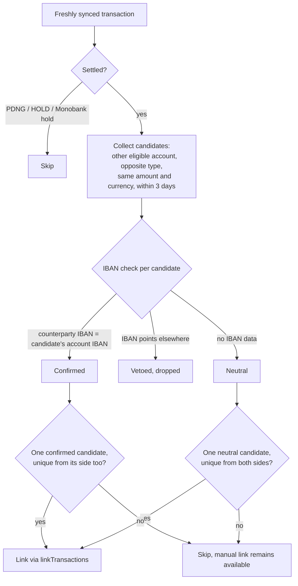

# Automatic transfer linking on bank sync

After every provider sync, `utils/auto-link-transfers.ts` scans the freshly imported transactions and links pairs that form the two legs of a transfer between the user's own synced accounts. Linking uses the same `linkTransactions` service as the manual UI flow: both rows get one `transferId` and `transferNature: common_transfer`. The caller then drops linked ids from the `TRANSACTIONS_SYNCED` event, so AI categorization, payee promotion, and subscription matching never process transfer legs.

## Decision flow

## Matching rules

A pair must pass all of these:

- Different accounts, same user. Walutomat accounts never participate on either side. Manual (`system`) accounts participate as candidates only when the user enables `matchTransfersWithManualAccounts` (see below); they are otherwise excluded like Walutomat.
- Opposite transaction types: expense on one side, income on the other.
- Same currency and the same amount, compared in cents. Cross-currency transfers never auto-link.
- Dates within 3 days of each other.
- Both rows settled. The matcher skips pending rows (Enable Banking `PDNG`/`HOLD`, Monobank authorization holds).
- Neither row is a transfer leg or refund-linked already.

## IBAN gate

When a transaction carries a counterparty IBAN (Enable Banking stores `creditorAccount` for expenses, `debtorAccount` for incomes), the matcher compares it against the other account's own IBAN:

- Match confirms the pair. A `-PLN 100` on account A whose `creditorAccount` equals account B's IBAN links to the `+PLN 100` on B.
- Mismatch vetoes the candidate, but only when both halves of the comparison exist: a counterparty IBAN on the row (only Enable Banking rows carry one) and a stored own IBAN on the other leg's account (Enable Banking and Monobank store one, SimpleFIN and LunchFlow do not).
- Either half missing sends the pair to the uniqueness rule below.

A confirmed pair still fails if a second confirmed candidate exists.

## Both-sides uniqueness

Without an IBAN confirmation, a pair links only when each leg has one possible partner.

Account B receives `+PLN 100` on Tuesday. Account A holds one `-PLN 100` that week, so B's side sees one candidate. The matcher then flips perspective: from A's expense, how many `+PLN 100` incomes fit the window? If account C received `+PLN 100` the same week, the expense has two possible partners and nothing links.

The rule stays conservative on purpose. Fixing a missed link takes two clicks in the UI; a wrong link corrupts stats until someone spots the odd numbers.

## Manual accounts

The user setting `matchTransfersWithManualAccounts` (off by default) adds manual (`system`) accounts to the candidate pool. It is opt-in because a linked row becomes a transfer leg, and transfer legs carry no category: a manually recorded, hand-categorized expense disappears from category stats the moment the matcher claims it.

Seeds stay restricted to synced rows whether the setting is on or off. The matcher only ever runs over the ids a provider sync produced, so the flow is one-directional: an existing manual row is picked up when the bank leg syncs, never the reverse. Recording the manual row after the bank sync leaves the pair unlinked.

Manual rows carry no `externalData`, hence no counterparty IBAN, so the IBAN gate can never confirm or veto a bank↔manual pair. Every such pair is decided by the both-sides-uniqueness rule: it links only when the bank leg has exactly one manual candidate and that manual row has exactly one bank candidate in return.

## Per-provider behavior

| Provider       | Counterparty IBAN                       | Pending semantics                                                                                                                                                                                                                                                                                                      |
| -------------- | --------------------------------------- | ---------------------------------------------------------------------------------------------------------------------------------------------------------------------------------------------------------------------------------------------------------------------------------------------------------------------- |
| Enable Banking | Yes (`creditorAccount`/`debtorAccount`) | `PDNG`/`HOLD` rows wait until booked; linking one would block the pending→booked upgrade and duplicate the row                                                                                                                                                                                                         |
| Monobank       | No                                      | `hold: true` rows are card authorization holds and are permanently excluded. Sync dedupes on `originalId`, so the settled payload is skipped as a duplicate and the row never reaches the matcher again. Transfers between own accounts post directly rather than as holds, so the exclusion costs nothing in practice |
| LunchFlow      | No                                      | The feed has no pending states                                                                                                                                                                                                                                                                                         |
| SimpleFIN      | No                                      | Only posted transactions reach the ledger                                                                                                                                                                                                                                                                              |
| Walutomat      | n/a                                     | n/a. The matcher runs on Walutomat syncs like on any other, but Walutomat rows are excluded on both sides. Walutomat's own matchers own them: FX pairs by shared `originalId`, PAYIN/PAYOUT by exact IBAN (`walutomat/cross-provider-linking.ts`)                                                                      |

A row that a sync upgraded from pending to booked becomes linkable without being newly created. Such rows are handed to the matcher as extra candidates while staying out of the sync event, since they were emitted when they first landed.

Cross-provider pairs (Monobank ↔ Enable Banking, for example) need no special handling: whichever account syncs second finds the first sync's committed row as a candidate. One consequence for Walutomat: when a bank leg of a Walutomat pair coincides in amount, currency and date with an unrelated row, the generic matcher can claim that bank leg first. Recovery is a manual unlink; the Walutomat matcher then re-claims the pair on its next sync.

## Concurrency and safety

- A per-user `pg_advisory_xact_lock` serializes concurrent matchers. Without it, two syncs could claim overlapping pairs and leave a row holding a `transferId` with no counterpart. The lock also guarantees the later matcher sees the earlier sync's committed rows.
- The matcher scans only the ids the triggering sync produced, so a pair the user unlinked by hand stays unlinked through later syncs.
- The matcher joins the sync's transaction, which it must do to see the rows the sync just created but has not committed yet. A non-database error is logged and abandons the rest of that run's pairs; the pairs already linked stay linked and stay out of the sync event. A database error propagates and fails the sync, because it has already aborted the shared transaction.
