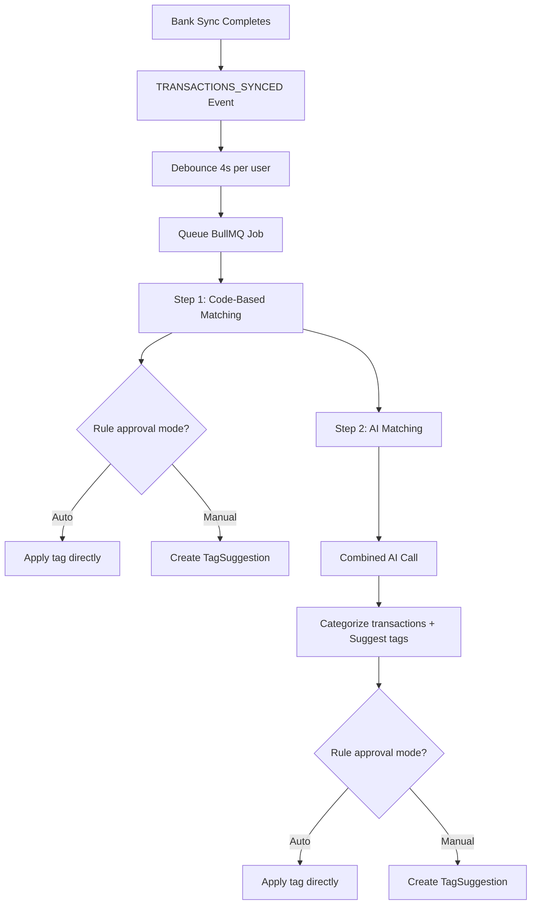
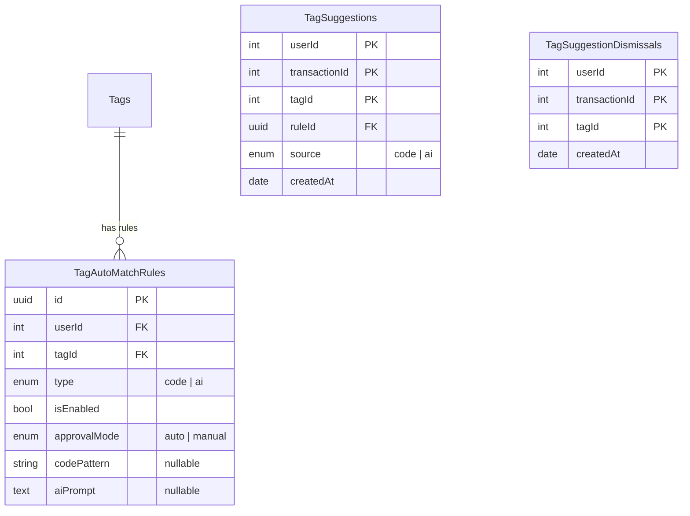

# Tag Auto-Matching

Automatically assigns tags to transactions based on user-defined rules. Supports two rule types (code-based and AI-based) and two approval modes (auto-apply and manual review).

## Rule Types

### Code-Based Rules

- Fuzzy substring matching on the transaction `note` field using [Fuse.js](https://www.fusejs.io/)
- Each rule has a `codePattern` (e.g., "netflix", "uber eats")
- Maximum **5 code-based rules** per tag
- Default approval mode: **auto** (applies tags immediately)

### AI-Based Rules

- Uses a custom prompt to let the AI decide whether a tag should be applied
- Each rule has an `aiPrompt` (e.g., "anything related to car maintenance, fuel, parking")
- Maximum **1 AI-based rule** per tag
- The tag's `description` field is also sent to the AI for context
- Default approval mode: **manual** (creates a suggestion for user review)

## Matching Pipeline

The tag matching runs as part of the existing AI categorization worker, triggered by the `TRANSACTIONS_SYNCED` event after bank data sync.



### Processing Order

1. **Code-based matching runs first** — deterministic, fast, no API calls
2. **AI-based matching runs second** — combined with the existing AI categorization call
3. Code rules take priority: if a transaction is already tagged by a code rule, the AI won't re-suggest the same tag

### Batch Processing

Transactions are processed in batches of 500 (matching the existing categorization batch size). For large imports with thousands of transactions, the job processes multiple batches sequentially.

## Approval Modes

Each rule has its own `approvalMode`:

| Mode     | Behavior                                                                |
| -------- | ----------------------------------------------------------------------- |
| `auto`   | Tag is applied to the transaction immediately. No user action needed.   |
| `manual` | A `TagSuggestion` record is created. User reviews and approves/rejects. |

## Suggestion Review

Pending suggestions are surfaced in **Optimizations > Tag Suggestions**. Users can:

- **Approve** a suggestion (applies the tag, removes the suggestion)
- **Reject** a suggestion (creates a dismissal, removes the suggestion)
- **Bulk approve/reject** all visible suggestions

## Dismissals

When a user rejects a suggestion, a `TagSuggestionDismissal` record is created for that `(transactionId, tagId)` pair. The system will never re-suggest the same tag for that transaction.

## Auto-Resolution

When a user manually adds a tag to a transaction (via the standard tag assignment flow), any pending suggestion for the same `(transactionId, tagId)` is automatically removed. This prevents stale suggestions from accumulating.

## Data Model



## File Structure

```
services/tag-auto-matching/
├── README.md                           ← this file
├── auto-match-rules.service.ts         ← rule CRUD (create, list, update, delete, toggle)
├── tag-auto-matching.service.ts        ← matching orchestration (code + AI)
├── code-matcher.ts                     ← Fuse.js fuzzy matching engine
└── build-tag-prompt.ts                 ← formats tags for the AI prompt

services/tag-suggestions/
└── tag-suggestions.service.ts          ← suggestion CRUD, approve, reject, bulk actions

services/ai-categorization/
├── categorization-service.ts           ← extended to accept tags for combined AI call
├── prompt-builder.ts                   ← extended with tag matching prompt sections
└── utils/parse-response.ts            ← extended to parse T: tag suggestion lines
```
