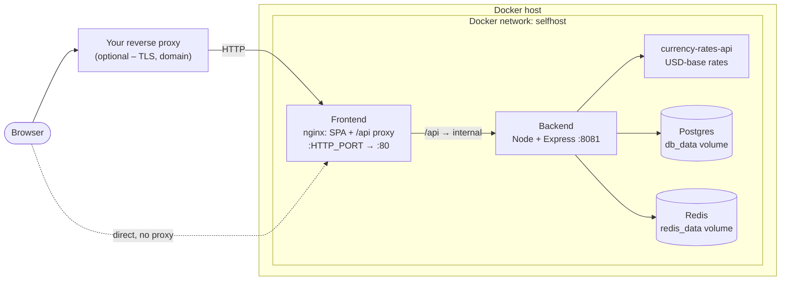

# Setup Guide

Run Budget Tracker on your own server. The stack pulls published multi-arch
images and exposes the whole app on **one host port**. You put whatever reverse
proxy you already run in front of it – Nginx Proxy Manager, npmplus, Caddy,
Traefik, or nothing at all for a LAN / localhost trial. A bundled Traefik
overlay is available if you'd rather the stack terminate TLS itself.

This guide assumes:

- A host with Docker Engine + the Compose plugin (a fresh Ubuntu 22.04 / 24.04
  or Debian 12 VPS is the common case, but any Docker host works).
- 2 GB RAM minimum. The pull-based path is light; only the optional
  build-from-source overlay is memory-heavy.

The stack is: the **frontend** (nginx serving the SPA and reverse-proxying
`/api` to the backend), the **backend** (Node + Express), **Postgres** for
storage, **Redis** for queues, and the `currency-rates-api` sidecar for
exchange-rate data. No external API keys are required for core functionality.

## What you get



The frontend container is the single public entrypoint. It serves the SPA and
proxies `/api/` to the backend over the internal `selfhost` network, so the
browser only ever talks to **one origin** – app and API are same-origin, and
there is no CORS to configure. Only the frontend's host port
(`${HTTP_PORT:-8080}`) is published; Postgres, Redis, the backend, and the
rate-data sidecar are reachable only from the `selfhost` network.

> **Architecture**: the frontend, backend, postgres, and redis images are
> multi-arch and run natively on both `amd64` and `arm64` hosts (Hetzner ARM,
> Oracle Ampere, AWS Graviton). The `currency-rates-api` sidecar is currently
> published as `amd64` only, so on an `arm64` host Docker runs it under QEMU
> emulation – functional but slower at rate-sync time.

## Table of Contents

1. [Prerequisites](#1-prerequisites)
2. [Quickstart](#2-quickstart)
3. [Behind your own reverse proxy](#3-behind-your-own-reverse-proxy)
4. [Optional: build from source](#4-optional-build-from-source)
5. [Backups](#5-backups)

Reference docs: [reverse proxies](reverse-proxies.md) ·
[Traefik overlay](traefik-overlay.md) ·
[environment variables](environment-reference.md) ·
[troubleshooting](troubleshooting.md)

---

## 1. Prerequisites

Docker Engine with the Compose plugin must be installed — see the
[official install guide](https://docs.docker.com/engine/install/) for your
platform. Verify with:

```bash
docker --version
docker compose version
```

## 2. Quickstart

You need two things on the host: the compose file(s) and a filled-in `.env`,
side by side. Cloning the repo is the simplest way to get them, but for the
pull-based path you can also just download the `self-hosting/` folder on its
own – it is self-contained: the compose file, the overlays, and your `.env` all
live in it, and the backend reads `.env` from that same directory. (Building
from source still needs the full repo checkout.)

```bash
git clone https://github.com/letehaha/budget-tracker.git
cd budget-tracker/self-hosting
cp .env.example .env
```

Open `.env` and fill the **REQUIRED** section. The minimum to boot:

```bash
NODE_ENV=production

# The URL you open the app at in the browser. The default works for a
# localhost trial as-is; for a real deployment set your public URL
# (e.g. https://budget.example.com – it serves both the app and /api).
BETTER_AUTH_URL=http://localhost:8080
AUTH_ORIGIN=http://localhost:8080

# Auth secrets – generate three fresh, distinct values.
# Use `openssl rand -base64 32` to generate values.
APPLICATION_JWT_SECRET=<paste output of: openssl rand -base64 32>
APP_SESSION_ID_SECRET=<paste output of: openssl rand -base64 32>
BETTER_AUTH_SECRET=<paste output of: openssl rand -base64 32>

# Database password (the other DB_* values already have sane defaults).
APPLICATION_DB_PASSWORD=<paste output of: openssl rand -base64 32>
```

> The backend refuses to start while any of `APPLICATION_JWT_SECRET`,
> `APP_SESSION_ID_SECRET`, `BETTER_AUTH_SECRET`, or `APPLICATION_DB_PASSWORD`
> is still `__REPLACE_ME__`.

> **`BETTER_AUTH_URL` and `AUTH_ORIGIN` always carry the same value** – the
> URL a browser uses to reach the app. The API is served under `/api/v1` on
> that same origin, so there is no separate API URL to configure. When you
> later put the app behind a domain, update both to that URL and restart.

Start the stack from the `self-hosting/` folder:

```bash
docker compose up -d
```

This pulls the published images (`letehaha/budget-tracker-fe`,
`letehaha/budget-tracker-be`, `letehaha/currency-rates-api`, `postgres:16`,
`redis:7`) and starts everything. The backend runs database migrations on boot
before it starts serving, so its healthcheck stays red for the first
30–60 seconds – that's expected.

Watch the logs:

```bash
docker compose logs -f
```

Then open the app on the published port:

```
http://<host>:8080
```

Set `HTTP_PORT` in `.env` to publish on a different port. On a
laptop this is a complete localhost trial – no domain, no TLS, no reverse
proxy needed. For a public deployment, put a reverse proxy in front (next
section).

> **Keep `.env` on the host, not in an image.** Compose auto-loads it as
> `./.env` beside the compose file – for interpolation into the frontend
> `environment:` block and the compose-level settings, and via `env_file:` for
> the backend container's runtime env. It is never copied into any image, so DB
> password and auth secrets stay out of pushed image layers. Do **not** commit
> it to git.

## 3. Behind your own reverse proxy

Point your existing reverse proxy at the published frontend port
(`http://<host>:8080` by default) and terminate TLS there. Proxy-side
requirements and per-proxy recipes (Nginx Proxy Manager, Caddy) are in
[reverse-proxies.md](reverse-proxies.md).

On the app side, set `BETTER_AUTH_URL` and `AUTH_ORIGIN` to the public HTTPS
origin your proxy serves (e.g. `https://budget.example.com`), then `up -d`
again.

No reverse proxy yet? The stack can terminate TLS itself with the bundled
Traefik overlay – see [traefik-overlay.md](traefik-overlay.md).

## 4. Optional: build from source

Contributors and forks can build the images locally instead of pulling them.
Add the build overlay and pass `--build`:

```bash
docker compose -f docker-compose.yml \
  -f docker-compose.build.yml up -d --build
```

Runtime configuration is unchanged – the frontend is still configured through
the `environment:` block and the backend through `env_file:`. The build args
only feed build-time concerns (e.g. Sentry source-map upload) and are all
optional; see the **BUILD-FROM-SOURCE ONLY** section of
`.env.example`. This path is memory-heavy: if the frontend build
OOMs, add 2 GB of swap (see [troubleshooting.md](troubleshooting.md)).

## 5. Backups

The two stateful volumes are `db_data` (Postgres) and `redis_data` (Redis).
Redis is queue-only – its data is regenerated on the fly, so back up Postgres
only.

```bash
# Daily dump
docker compose exec -T db \
  pg_dump -U "$APPLICATION_DB_USERNAME" "$APPLICATION_DB_DATABASE" \
  | gzip > "backup-$(date +%F).sql.gz"
```

Restore:

```bash
gunzip -c backup-2026-05-01.sql.gz | \
  docker compose exec -T db \
  psql -U "$APPLICATION_DB_USERNAME" "$APPLICATION_DB_DATABASE"
```

---

## Troubleshooting

Common issues – `502` from `/api`, backend boot failures, CSP errors,
Let's Encrypt problems, and more – are covered in
[troubleshooting.md](troubleshooting.md).

---

## NOTES

- **Same-origin by default.** The frontend proxies `/api` to the backend
  internally, so app and API share one origin and there is no CORS to manage.
  A separate API origin (`API_HTTP` + split-domain Traefik) remains possible
  but is opt-in.
- **Runtime-configurable frontend image.** The published frontend image reads
  its config from env at container start (writing `window.__APP_CONFIG__` and
  rendering the CSP), so analytics keys, API target, and CSP hosts change with
  a restart – no rebuild. `VITE_SENTRY_RELEASE` is the one deployment value
  baked in, because it names the source maps uploaded for that exact bundle;
  changing it meaningfully requires a rebuild.
